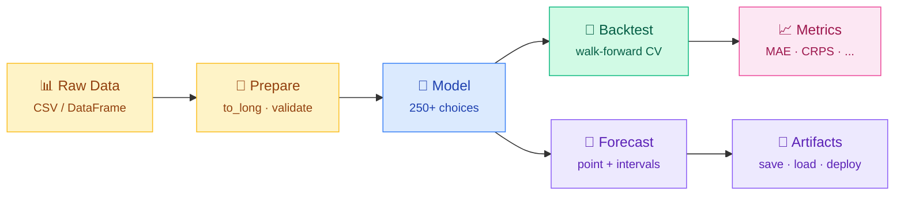
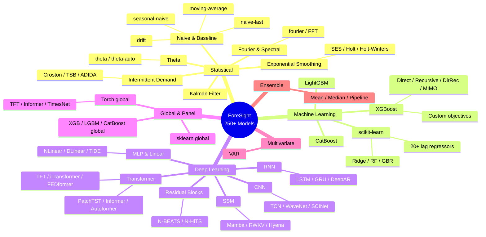
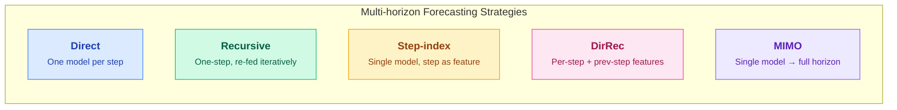
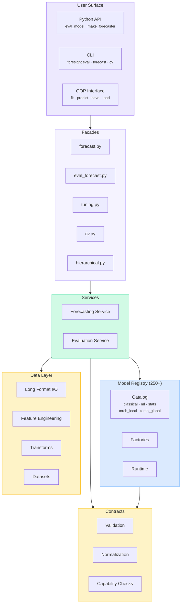
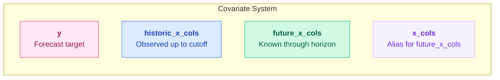
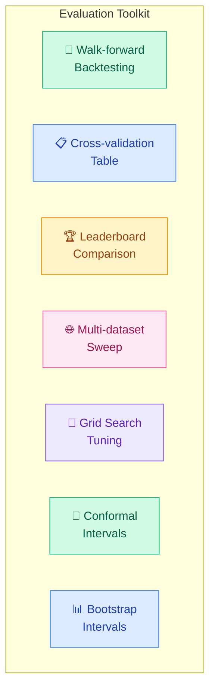

<div align="center">

<picture>
  <source media="(prefers-color-scheme: dark)" srcset="docs/assets/banner.svg">
  <source media="(prefers-color-scheme: light)" srcset="docs/assets/banner.svg">
  
</picture>

<br/>

**A lightweight, batteries-included time-series forecasting toolkit for Python.**

Unified model registry &bull; Walk-forward backtesting &bull; Probabilistic forecasting &bull; CLI + Python API

[](https://pypi.org/project/foresight-ts/)
[](https://pypi.org/project/foresight-ts/)
[](https://github.com/skygazer42/ForeSight/blob/main/LICENSE)
[](https://github.com/skygazer42/ForeSight)
[](https://github.com/skygazer42/ForeSight/commits/main)

<br/>

[Installation](#-installation) · [Quick Start](#-quick-start) · [Model Zoo](#-model-zoo) · [Architecture](#-architecture) · [Docs](https://skygazer42.github.io/ForeSight/) · [Contributing](#-contributing)

</div>

<br/>

<div align="center">

```
  250+ models · 7 backends · 20+ metrics · 1 unified interface
```

</div>

## Highlights

<table>
<tr>
<td width="50%">

### 🧠 250+ Models, One Interface

Statistical, ML, and deep learning models all share the same
`forecaster(train, horizon) → ŷ` contract. From naive baselines
to Transformers and Mamba — unified under one API.

</td>
<td width="50%">

### 🔄 Backtesting-First Design

Walk-forward evaluation with expanding or rolling windows,
full cross-validation predictions table, per-step metrics,
and conformal prediction intervals — all built in.

</td>
</tr>
<tr>
<td width="50%">

### 📊 Panel & Global Models

First-class multi-series support via `unique_id / ds / y` long
format. Global models train across thousands of series with
covariate-aware feature engineering.

</td>
<td width="50%">

### ⚡ Minimal by Default

Core depends only on `numpy` + `pandas`. Heavy backends
(PyTorch, XGBoost, LightGBM, CatBoost, statsmodels, scikit-learn)
are all opt-in extras.

</td>
</tr>
<tr>
<td width="50%">

### 📐 Probabilistic Forecasting

Quantile regression, conformal intervals, bootstrap intervals,
CRPS, pinball loss — production-ready uncertainty quantification
across all model families.

</td>
<td width="50%">

### 🏭 Production-Friendly

`fit` / `predict` object API, model artifact save/load with
schema versioning, hierarchical reconciliation, grid-search
tuning, and a full-featured CLI.

</td>
</tr>
</table>

> **Design inspired by** [StatsForecast](https://github.com/Nixtla/statsforecast) · [Darts](https://github.com/unit8co/darts) · [sktime](https://www.sktime.org/) · [NeuralForecast](https://github.com/Nixtla/neuralforecast) · [Prophet](https://facebook.github.io/prophet/)

---

## ⚙️ How It Works

<div align="center">

</div>

<br/>



---

## 📦 Installation

```bash
pip install foresight-ts                # core (numpy + pandas only)
```

Install optional backends as needed:

```bash
pip install "foresight-ts[ml]"          # scikit-learn models
pip install "foresight-ts[xgb]"         # XGBoost models
pip install "foresight-ts[lgbm]"        # LightGBM models
pip install "foresight-ts[catboost]"    # CatBoost models
pip install "foresight-ts[stats]"       # statsmodels (ARIMA, ETS, VAR, …)
pip install "foresight-ts[torch]"       # PyTorch neural models
pip install "foresight-ts[all]"         # everything above
```

<details>
<summary><b>Install from source (for development)</b></summary>

```bash
git clone https://github.com/skygazer42/ForeSight.git
cd ForeSight
pip install -e ".[dev]"     # editable install + pytest, ruff, mypy
```

</details>

---

## 🚀 Quick Start

### Python API

```python
from foresight import eval_model, make_forecaster, make_forecaster_object

# 1️⃣ Walk-forward evaluation on a built-in dataset
metrics = eval_model(
    model="theta", dataset="catfish", y_col="Total",
    horizon=3, step=3, min_train_size=12,
)
print(metrics)  # {'mae': ..., 'rmse': ..., 'mape': ..., 'smape': ...}

# 2️⃣ Functional API — stateless forecaster
f = make_forecaster("holt", alpha=0.3, beta=0.1)
yhat = f([112, 118, 132, 129, 121, 135, 148, 148], horizon=3)

# 3️⃣ Object API — fit / predict / save / load
obj = make_forecaster_object("moving-average", window=3)
obj.fit([1, 2, 3, 4, 5, 6])
yhat = obj.predict(3)
```

### CLI

```bash
# Discover models and datasets
foresight models list                     # list all 250+ models
foresight models info theta               # inspect parameters & defaults
foresight datasets list                   # browse built-in datasets

# Evaluate a model
foresight eval run --model theta --dataset catfish --y-col Total \
    --horizon 3 --step 3 --min-train-size 12

# Compare models on a leaderboard
foresight leaderboard models --dataset catfish --y-col Total \
    --horizon 3 --step 3 --min-train-size 12 \
    --models naive-last,seasonal-naive,theta,holt

# Forecast from any CSV
foresight forecast csv --model naive-last --path ./data.csv \
    --time-col ds --y-col y --parse-dates --horizon 7

# Cross-validation from any CSV
foresight cv csv --model naive-last --path ./data.csv \
    --time-col ds --y-col y --parse-dates \
    --horizon 3 --step-size 1 --min-train-size 24

# Detect anomalies from any CSV
foresight detect csv --path ./anomaly.csv \
    --time-col ds --y-col y --parse-dates \
    --score-method rolling-zscore --threshold-method zscore
```

Long-running CLI commands emit enhanced runtime logs to `stderr` by default, so
`stdout` stays clean for JSON / CSV piping and file redirects.

<details>
<summary><b>More Python API examples (intervals, tuning, global models, hierarchical)</b></summary>

```python
import pandas as pd
from foresight import (
    bootstrap_intervals,
    detect_anomalies,
    eval_hierarchical_forecast_df,
    forecast_model, tune_model, save_forecaster, load_forecaster,
    make_forecaster_object,
    make_global_forecaster, make_multivariate_forecaster,
    build_hierarchy_spec, reconcile_hierarchical_forecasts,
)

# Forecast with bootstrap prediction intervals
future_df = forecast_model(
    model="naive-last",
    y=[1, 2, 3, 4, 5, 6],
    ds=pd.date_range("2024-01-01", periods=6, freq="D"),
    horizon=3,
    interval_levels=(0.8, 0.9),
    interval_min_train_size=4,
)

# Save / load trained model artifacts
obj = make_forecaster_object("theta", alpha=0.3)
obj.fit([1, 2, 3, 4, 5])
save_forecaster(obj, "/tmp/theta.pkl")
loaded = load_forecaster("/tmp/theta.pkl")

# Detect anomalies from a dataset-backed series
anomalies = detect_anomalies(
    dataset="catfish",
    y_col="Total",
    model="naive-last",
    score_method="forecast-residual",
    min_train_size=24,
    step_size=1,
)

# Grid search tuning
result = tune_model(
    model="moving-average", dataset="catfish", y_col="Total",
    horizon=1, step=1, min_train_size=24, max_windows=8,
    search_space={"window": (1, 3, 6)},
)

# Multivariate model (VAR)
mv = make_multivariate_forecaster("var", maxlags=1)
yhat_mv = mv(wide_df[["sales", "traffic"]], horizon=2)

# Hierarchical reconciliation
hierarchy = build_hierarchy_spec(raw_df, id_cols=("region", "store"), root="total")
reconciled = reconcile_hierarchical_forecasts(
    forecast_df=pred_df, hierarchy=hierarchy,
    method="top_down", history_df=history_long,
)
hier_payload = eval_hierarchical_forecast_df(
    forecast_df=reconciled,
    hierarchy=hierarchy,
    y_col="y",
)
```

</details>

<details>
<summary><b>More CLI examples (artifacts, covariates, sweep)</b></summary>

```bash
# Forecast with prediction intervals
foresight forecast csv --model naive-last --path ./my.csv \
    --time-col ds --y-col y --parse-dates --horizon 3 \
    --interval-levels 80,90 --interval-min-train-size 12

# Enhanced runtime logs go to stderr; stdout remains pipe-safe
foresight forecast csv --model torch-mlp-direct --path ./train.csv \
    --time-col ds --y-col y --parse-dates --horizon 3 \
    --model-param lags=24 --model-param epochs=10 \
    --format json > /tmp/forecast.json

# Reduce per-epoch chatter or persist structured event logs
foresight eval run --model theta --dataset catfish --y-col Total \
    --horizon 3 --step 3 --min-train-size 12 \
    --no-progress --log-style plain --log-file /tmp/eval-log.jsonl

# Save and reuse model artifacts
foresight forecast csv --model naive-last --path ./my.csv \
    --time-col ds --y-col y --parse-dates --horizon 3 \
    --save-artifact /tmp/naive-last.pkl
foresight forecast artifact --artifact /tmp/naive-last.pkl --horizon 3

# Save and reuse a local x_cols artifact with the saved future covariates
foresight forecast csv --model sarimax --path ./my_exog.csv \
    --time-col ds --y-col y --parse-dates --horizon 3 \
    --model-param order=0,0,0 --model-param seasonal_order=0,0,0,0 \
    --model-param trend=c --model-param x_cols=promo \
    --save-artifact /tmp/sarimax.pkl
foresight forecast artifact --artifact /tmp/sarimax.pkl --horizon 2

# Override the saved future covariates with a new future CSV
foresight forecast artifact --artifact /tmp/sarimax.pkl \
    --future-path ./my_exog_future.csv --time-col ds --parse-dates \
    --horizon 4

# Reuse a quantile-capable global artifact and derive interval columns
foresight forecast artifact --artifact /tmp/xgb-global.pkl \
    --horizon 2 --interval-levels 80

# Override a saved global artifact with new future covariates
# The override CSV can contain canonical unique_id values or the raw id columns
# that were used when the artifact was saved, plus ds and required x_cols.
# Single-series global artifacts can also omit id columns entirely.
foresight forecast artifact --artifact /tmp/ridge-global.pkl \
    --future-path ./my_global_future.csv --time-col ds --parse-dates \
    --horizon 2

foresight artifact info --artifact /tmp/naive-last.pkl
foresight artifact info --artifact /tmp/naive-last.pkl --format markdown
foresight artifact validate --artifact /tmp/naive-last.pkl
foresight artifact diff \
    --left-artifact /tmp/naive-last.pkl \
    --right-artifact /tmp/naive-last-v2.pkl \
    --path-prefix metadata.train_schema.runtime --format csv
foresight artifact diff \
    --left-artifact /tmp/naive-last.pkl \
    --right-artifact /tmp/naive-last-v2.pkl \
    --path-prefix tracking_summary --format csv
foresight artifact diff \
    --left-artifact /tmp/naive-last.pkl \
    --right-artifact /tmp/naive-last-v2.pkl \
    --path-prefix future_override_schema --format markdown

# SARIMAX with exogenous features
foresight forecast csv --model sarimax --path ./my_exog.csv \
    --time-col ds --y-col y --parse-dates --horizon 3 \
    --model-param order=0,0,0 --model-param x_cols=promo

# Anomaly detection with exogenous covariates
foresight detect csv --model sarimax --path ./my_exog.csv \
    --time-col ds --y-col y --parse-dates \
    --score-method forecast-residual --threshold-method mad \
    --min-train-size 24 --model-param order=0,0,0 \
    --model-param seasonal_order=0,0,0,0 \
    --model-param trend=c --model-param x_cols=promo

# Multi-dataset sweep (parallel + resumable)
foresight leaderboard sweep \
    --datasets catfish,ice_cream_interest \
    --models naive-last,theta --horizon 3 --step 3 \
    --min-train-size 12 --jobs 4 --progress

# Conformal prediction intervals
foresight eval run --model theta --dataset catfish --y-col Total \
    --horizon 3 --step 3 --min-train-size 12 --conformal-levels 80,90

# Cross-validation predictions table
foresight cv run --model theta --dataset catfish --y-col Total \
    --horizon 3 --step-size 3 --min-train-size 12 --n-windows 30

# Cross-validation on arbitrary CSV data
foresight cv csv --model sarimax --path ./my_exog.csv \
    --time-col ds --y-col y --parse-dates \
    --horizon 3 --step-size 3 --min-train-size 24 \
    --model-param order=0,0,0 \
    --model-param seasonal_order=0,0,0,0 \
    --model-param trend=c --model-param x_cols=promo \
    --format json > /tmp/cv.json
```

</details>

---

## 🧠 Model Zoo

ForeSight organizes **250+** registered models into families. Core models are dependency-free; optional models activate with the corresponding extra.

### Model Landscape



### Core Models (no extra dependencies)

| Family | Models | Key Parameters |
|--------|--------|---------------|
| **Naive / Baseline** | `naive-last`, `seasonal-naive`, `mean`, `median`, `drift`, `moving-average`, `weighted-moving-average`, `moving-median`, `seasonal-mean`, `seasonal-drift` | `season_length`, `window` |
| **Exponential Smoothing** | `ses`, `ses-auto`, `holt`, `holt-auto`, `holt-damped`, `holt-winters-add`, `holt-winters-add-auto` | `alpha`, `beta`, `gamma`, `season_length` |
| **Theta** | `theta`, `theta-auto` | `alpha`, `grid_size` |
| **AR / Regression** | `ar-ols`, `ar-ols-lags`, `sar-ols`, `ar-ols-auto`, `lr-lag`, `lr-lag-direct` | `p`, `lags`, `season_length` |
| **Fourier / Spectral** | `fourier`, `fourier-multi`, `poly-trend`, `fft` | `period`, `order`, `top_k` |
| **Kalman Filter** | `kalman-level`, `kalman-trend` | `process_variance`, `obs_variance` |
| **Intermittent Demand** | `croston`, `croston-sba`, `croston-sbj`, `croston-opt`, `tsb`, `les`, `adida` | `alpha`, `beta` |
| **Meta / Ensemble** | `pipeline`, `ensemble-mean`, `ensemble-median` | `base`, `members`, `transforms` |

### Optional Models

<details>
<summary><b>scikit-learn</b> — <code>pip install "foresight-ts[ml]"</code></summary>

**Local (lag-feature + direct multi-horizon):**

`ridge-lag`, `ridge-lag-direct`, `rf-lag`, `decision-tree-lag`, `extra-trees-lag`, `adaboost-lag`, `bagging-lag`, `lasso-lag`, `elasticnet-lag`, `knn-lag`, `gbrt-lag`, `hgb-lag`, `svr-lag`, `linear-svr-lag`, `kernel-ridge-lag`, `mlp-lag`, `huber-lag`, `quantile-lag`, `sgd-lag`

**Global/panel (step-lag, trains across all series):**

`ridge-step-lag-global`, `rf-step-lag-global`, `extra-trees-step-lag-global`, `gbrt-step-lag-global`, `decision-tree-step-lag-global`, `bagging-step-lag-global`, `lasso-step-lag-global`, `elasticnet-step-lag-global`, `knn-step-lag-global`, `svr-step-lag-global`, `mlp-step-lag-global`, and more

</details>

<details>
<summary><b>XGBoost</b> — <code>pip install "foresight-ts[xgb]"</code></summary>

| Strategy | Models |
|----------|--------|
| Direct | `xgb-lag`, `xgb-dart-lag`, `xgbrf-lag`, `xgb-linear-lag` |
| Recursive | `xgb-lag-recursive`, `xgb-dart-lag-recursive`, `xgb-linear-lag-recursive` |
| Step-index | `xgb-step-lag` |
| DirRec | `xgb-dirrec-lag` |
| MIMO | `xgb-mimo-lag` |
| Custom objectives | `xgb-mae-lag`, `xgb-huber-lag`, `xgb-quantile-lag`, `xgb-poisson-lag`, `xgb-gamma-lag`, ... |
| **Global/panel** | `xgb-step-lag-global` (supports quantile output) |

</details>

<details>
<summary><b>LightGBM</b> — <code>pip install "foresight-ts[lgbm]"</code></summary>

**Local:** `lgbm-lag`, `lgbm-lag-recursive`, `lgbm-step-lag`, `lgbm-dirrec-lag`, `lgbm-custom-lag`

**Global/panel:** `lgbm-step-lag-global` (supports quantile output)

</details>

<details>
<summary><b>CatBoost</b> — <code>pip install "foresight-ts[catboost]"</code></summary>

**Local:** `catboost-lag`, `catboost-lag-recursive`, `catboost-step-lag`, `catboost-dirrec-lag`

**Global/panel:** `catboost-step-lag-global` (supports quantile output)

</details>

<details>
<summary><b>statsmodels</b> — <code>pip install "foresight-ts[stats]"</code></summary>

| Family | Models |
|--------|--------|
| ARIMA | `arima`, `auto-arima`, `sarimax`, `autoreg` |
| Fourier Hybrid | `fourier-arima`, `fourier-auto-arima`, `fourier-autoreg`, `fourier-sarimax` |
| Decomposition | `stl-arima`, `stl-autoreg`, `stl-ets`, `mstl-arima`, `mstl-autoreg`, `mstl-ets`, `mstl-auto-arima` |
| TBATS-lite | `tbats-lite`, `tbats-lite-autoreg`, `tbats-lite-auto-arima` |
| Unobserved Components | `uc-local-level`, `uc-local-linear-trend`, `uc-seasonal` |
| ETS | `ets` |
| Multivariate | `var` |

</details>

<details>
<summary><b>PyTorch — Local models</b> — <code>pip install "foresight-ts[torch]"</code></summary>

| Category | Models |
|----------|--------|
| MLP / Linear | `torch-mlp-direct`, `torch-nlinear-direct`, `torch-dlinear-direct`, `torch-tide-direct`, `torch-kan-direct` |
| RNN | `torch-lstm-direct`, `torch-gru-direct`, `torch-bilstm-direct`, `torch-bigru-direct`, `torch-attn-gru-direct` |
| CNN | `torch-cnn-direct`, `torch-tcn-direct`, `torch-resnet1d-direct`, `torch-wavenet-direct`, `torch-inception-direct`, `torch-scinet-direct` |
| Transformer | `torch-transformer-direct`, `torch-patchtst-direct`, `torch-crossformer-direct`, `torch-pyraformer-direct`, `torch-fnet-direct`, `torch-tsmixer-direct`, `torch-retnet-direct` |
| Residual Blocks | `torch-nbeats-direct`, `torch-nhits-direct` |
| SSM / State-space | `torch-mamba-direct`, `torch-rwkv-direct`, `torch-hyena-direct` |
| Hybrid | `torch-etsformer-direct`, `torch-esrnn-direct`, `torch-lstnet-direct` |
| Probabilistic | `torch-deepar-recursive`, `torch-qrnn-recursive` |
| RNN Paper Zoo | 100 named paper architectures (`torch-rnnpaper-*-direct`) |
| RNN Zoo | 100 combos: 20 bases × 5 wrappers (`torch-rnnzoo-*-direct`) |
| Configurable Transformer | `torch-xformer-*-direct` — 10 attention variants × positional encodings × extras |

</details>

<details>
<summary><b>PyTorch — Global/panel models</b> — <code>pip install "foresight-ts[torch]"</code></summary>

Train across all series in long-format; supports covariates (`x_cols`), time features, and optional quantile regression.

| Category | Models |
|----------|--------|
| Transformer | `torch-tft-global`, `torch-informer-global`, `torch-autoformer-global`, `torch-fedformer-global`, `torch-patchtst-global`, `torch-itransformer-global`, `torch-timesnet-global`, `torch-tsmixer-global` |
| MLP / Linear | `torch-nbeats-global`, `torch-nhits-global`, `torch-nlinear-global`, `torch-dlinear-global`, `torch-tide-global` |
| RNN | `torch-deepar-global`, `torch-lstnet-global`, `torch-esrnn-global` |
| CNN | `torch-tcn-global`, `torch-wavenet-global`, `torch-scinet-global` |
| SSM | `torch-mamba-global`, `torch-rwkv-global`, `torch-hyena-global` |

</details>

### Multi-horizon Strategies



| Strategy | How it works | Suffix |
|----------|-------------|--------|
| **Direct** | One model per horizon step | `*-lag` |
| **Recursive** | One-step model, iteratively re-fed | `*-lag-recursive` |
| **Step-index** | Single model with step as a feature | `*-step-lag` |
| **DirRec** | Per-step model with previous-step features | `*-dirrec-lag` |
| **MIMO** | Single model predicts entire horizon | `*-mimo-lag` |

---

## 🏗️ Architecture

<div align="center">

</div>

<br/>



---

## 📐 Data Format

ForeSight uses a panel-friendly **long format** compatible with StatsForecast and Prophet:

| Column | Description |
|--------|-------------|
| `unique_id` | Series identifier (optional for single series) |
| `ds` | Timestamp (`datetime`) |
| `y` | Target value (`float`) |
| *extra columns* | Covariates / exogenous features |

### Covariate Roles



```python
from foresight.data import to_long, prepare_long_df

long_df = to_long(
    raw_df, time_col="ds", y_col="y",
    id_cols=("store", "dept"),
    historic_x_cols=("promo_hist",),
    future_x_cols=("promo_plan", "price"),
)

prepared = prepare_long_df(
    long_df, freq="D",
    y_missing="interpolate",
    historic_x_missing="ffill",
    future_x_missing="ffill",
)
```

---

## 📊 Evaluation & Backtesting

### Capabilities



| Capability | Description |
|-----------|-------------|
| **Walk-forward backtesting** | Expanding or rolling-window evaluation (`horizon`, `step`, `min_train_size`, `max_train_size`) |
| **Cross-validation table** | Full predictions DataFrame: `unique_id, ds, cutoff, step, y, yhat, model` |
| **Leaderboard** | Multi-model comparison on a single dataset |
| **Sweep** | Multi-dataset × multi-model benchmark with parallel workers + resume |
| **Tuning** | Grid search over model parameters, scored via backtesting |
| **Conformal intervals** | Symmetric prediction intervals from backtesting residuals |
| **Bootstrap intervals** | Non-parametric prediction intervals |

### Metrics

<table>
<tr>
<td><b>Point Metrics</b></td>
<td>MAE · RMSE · MAPE · sMAPE · WAPE · MASE · RMSSE · MSE</td>
</tr>
<tr>
<td><b>Probabilistic Metrics</b></td>
<td>Pinball loss · CRPS · Coverage · Width · Sharpness · Interval Score · Winkler Score · Weighted Interval Score · MSIS</td>
</tr>
</table>

### Probabilistic Forecasting

```bash
# Quantile regression with Torch global models
foresight eval run --model torch-itransformer-global \
    --dataset catfish --y-col Total --horizon 7 --step 7 --min-train-size 60 \
    --model-param quantiles=0.1,0.5,0.9
```

Produces `yhat_p10`, `yhat_p50`, `yhat_p90` columns alongside `yhat` (defaults to median quantile).

---

## 📦 Optional Dependencies

| Extra | Backend | Version | Example Models |
|-------|---------|---------|---------------|
| `[ml]` | scikit-learn | ≥ 1.0 | `ridge-lag`, `rf-lag`, `hgb-lag`, `mlp-lag`, `*-step-lag-global` |
| `[xgb]` | XGBoost | ≥ 2.0 | `xgb-lag`, `xgb-step-lag`, `xgb-mimo-lag`, `xgb-step-lag-global` |
| `[lgbm]` | LightGBM | ≥ 4.0 | `lgbm-lag`, `lgbm-step-lag-global` |
| `[catboost]` | CatBoost | ≥ 1.2 | `catboost-lag`, `catboost-step-lag-global` |
| `[stats]` | statsmodels | ≥ 0.14 | `arima`, `auto-arima`, `sarimax`, `ets`, `var`, `stl-*`, `mstl-*` |
| `[torch]` | PyTorch | ≥ 2.0 | `torch-transformer-direct`, `torch-tft-global`, `torch-mamba-global` |
| `[all]` | All of the above | — | — |

---

## 🗂️ Repository Structure

```
ForeSight/
├── src/foresight/              # Main Python package
│   ├── models/                 #   Model registry, catalog, factories
│   │   ├── catalog/            #     Model metadata shards
│   │   ├── factories.py        #     Runtime construction
│   │   └── registry.py         #     Public model facade
│   ├── services/               #   Forecast & evaluation orchestration
│   ├── contracts/              #   Validation & capability checks
│   ├── data/                   #   Long-format I/O & preprocessing
│   ├── datasets/               #   Built-in dataset registry
│   ├── features/               #   Feature engineering
│   ├── cli.py                  #   CLI entry point
│   ├── base.py                 #   BaseForecaster classes
│   ├── backtesting.py          #   Walk-forward engine
│   ├── metrics.py              #   20+ evaluation metrics
│   ├── conformal.py            #   Conformal prediction intervals
│   ├── hierarchical.py         #   Hierarchical reconciliation
│   └── transforms.py           #   Data transformations
├── examples/                   # Runnable example scripts
├── data/                       # Bundled CSV datasets
├── benchmarks/                 # Reproducible benchmark harness
├── tests/                      # 150+ test files
├── docs/                       # MkDocs documentation
└── tools/                      # Dev & release utilities
```

**Example scripts:** `quickstart_eval.py` · `leaderboard.py` · `cv_and_conformal.py` · `intermittent_demand.py` · `torch_global_models.py` · `rnn_paper_zoo.py`

---

## 🔬 Model Capability Flags

Model discovery surfaces machine-readable capability flags:

| Flag | Meaning |
|------|---------|
| `supports_panel` | Supports panel / multi-series workflows through the high-level long-format APIs |
| `supports_univariate` | Supports univariate forecasting targets |
| `supports_multivariate` | Supports multivariate / wide-matrix forecasting targets |
| `supports_probabilistic` | Supports probabilistic forecasting through intervals and/or quantiles |
| `supports_conformal_eval` | Can participate in conformal backtest evaluation flows |
| `supports_future_covariates` | Accepts known future covariates in supported workflows |
| `supports_historic_covariates` | Accepts historical covariate values in supported workflows |
| `supports_static_covariates` | Accepts series-level static covariates |
| `supports_refit_free_cv` | Can reuse training state across CV cutoffs without refitting from scratch |
| `supports_x_cols` | Accepts future covariates / exogenous regressors |
| `supports_static_cols` | Accepts series-level static covariates from `long_df` |
| `supports_quantiles` | Emits quantile forecast columns directly |
| `supports_interval_forecast` | Supports forecast intervals |
| `supports_interval_forecast_with_x_cols` | Supports forecast intervals when future covariates are provided |
| `supports_artifact_save` | Can be saved and reused through the artifact workflow |
| `requires_future_covariates` | Requires known future covariates |

```bash
foresight models info holt-winters-add    # see all flags & defaults
```

---

## 🧪 Benchmarks

ForeSight ships a reproducible benchmark harness for packaged datasets:

```bash
python benchmarks/run_benchmarks.py --smoke          # CI smoke run
python benchmarks/run_benchmarks.py --config baseline --format md
```

---

## 🤝 Contributing

We welcome contributions! Here's how to get started:

```bash
git clone https://github.com/skygazer42/ForeSight.git
cd ForeSight
pip install -e ".[dev]"

ruff check src tests tools    # lint
ruff format src tests tools   # format
pytest -q                     # test
```

See [`docs/DEVELOPMENT.md`](docs/DEVELOPMENT.md) for detailed guidelines and [`docs/ARCHITECTURE.md`](docs/ARCHITECTURE.md) for the layered design.

---

## 🔗 Related Projects

ForeSight draws design inspiration from these excellent projects:

| Project | Highlights |
|---------|-----------|
| [StatsForecast](https://github.com/Nixtla/statsforecast) | Fast statistical baselines, `unique_id/ds/y` convention, cross-validation |
| [NeuralForecast](https://github.com/Nixtla/neuralforecast) | Modern neural architectures (TFT, Informer, Autoformer, …) |
| [Darts](https://github.com/unit8co/darts) | Unified model API + backtesting helpers |
| [sktime](https://www.sktime.org/) | Unified `fit`/`predict` interface and evaluation utilities |
| [GluonTS](https://github.com/awslabs/gluonts) | Probabilistic forecasting datasets + benchmarking |
| [Prophet](https://facebook.github.io/prophet/) | `ds/y` DataFrame convention for forecasting |
| [PyTorch Forecasting](https://pytorch-forecasting.readthedocs.io/) | Deep learning forecasting pipelines |
| [Kats](https://github.com/facebookresearch/Kats) | Time series analysis & forecasting toolbox (Meta) |

---

## 📖 Citing ForeSight

If you find ForeSight useful in your research, please consider citing:

```bibtex
@software{foresight2024,
  title   = {ForeSight: A Lightweight Time-Series Forecasting Toolkit},
  author  = {ForeSight Contributors},
  year    = {2024},
  url     = {https://github.com/skygazer42/ForeSight},
  version = {0.2.9},
}
```

---

<div align="center">

**⚖️ License:** [GPL-3.0-only](LICENSE)

<br/>

Made with ❤️ by the ForeSight community

<br/>

<sub>

[Report Bug](https://github.com/skygazer42/ForeSight/issues) · [Request Feature](https://github.com/skygazer42/ForeSight/issues) · [Documentation](https://skygazer42.github.io/ForeSight/)

</sub>

</div>
