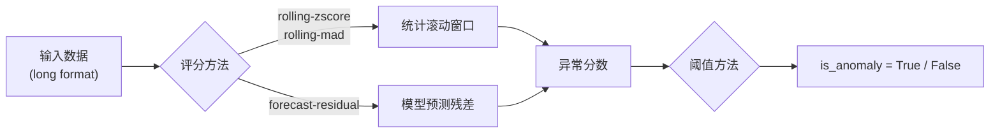

# 异常检测

ForeSight 提供内置的时间序列异常检测功能，支持两种评分策略：基于统计滚动窗口的方法和基于预测残差的方法。无论使用哪种策略，检测流程都是统一的：对每个时间点计算异常分数（score），然后与阈值（threshold）比较，判断是否为异常。

!!! info "适用场景"

    异常检测适用于已有历史数据的监控场景，例如：流量突变、传感器故障、销售额异常波动等。

---

## 检测流程概览



---

## 两种评分方法

=== "统计滚动方法"

    在不需要预测模型的情况下，直接对原始序列使用滚动窗口计算异常分数：

    | Score Method | 说明 |
    |-------------|------|
    | `rolling-zscore` | 滚动 Z-Score，默认方法（不指定 model 时） |
    | `rolling-mad` | 滚动 Median Absolute Deviation |

    优势：无需训练模型，计算快速，适合快速探索。

=== "预测残差方法"

    使用预测模型进行 walk-forward 预测，将实际值与预测值的残差作为异常分数：

    | Score Method | 说明 |
    |-------------|------|
    | `forecast-residual` | 使用指定模型的预测残差（需指定 `model` 参数） |

    优势：能捕获更复杂的异常模式（趋势偏离、季节性异常等）。

---

## detect_anomalies：数据集上的检测

对已注册的内置数据集直接运行异常检测：

```python
from foresight import detect_anomalies

result = detect_anomalies(
    dataset="catfish",
    y_col="Total",
    score_method="rolling-zscore",
    threshold_method="zscore",
    threshold_k=3.0,
    window=12,
)

# 查看检测到的异常点
anomalies = result[result["is_anomaly"]]
print(f"检测到 {len(anomalies)} 个异常点")
```

---

## detect_anomalies_long_df：自定义数据检测

对任意 long format DataFrame 运行异常检测：

```python
import pandas as pd
from foresight import detect_anomalies_long_df

long_df = pd.DataFrame({
    "unique_id": ["sensor_1"] * 100,
    "ds": pd.date_range("2023-01-01", periods=100, freq="D"),
    "y": [10 + i * 0.1 for i in range(95)] + [50, 55, 10.5, 10.6, 10.7],
    #                                          ^^  ^^  注入的异常点
})

result = detect_anomalies_long_df(
    long_df=long_df,
    score_method="rolling-zscore",
    window=14,
    threshold_k=2.5,
)
```

---

## 参数详解

### 评分参数

| 参数 | 默认值 | 说明 |
|------|--------|------|
| `score_method` | 自动选择 | 未指定 model 时默认 `rolling-zscore`；指定 model 时默认 `forecast-residual` |
| `window` | `12` | 滚动窗口大小（仅统计方法使用） |
| `min_history` | `3` | 开始计算分数前所需的最少历史点数（仅统计方法使用） |

### 阈值参数

| 参数 | 默认值 | 说明 |
|------|--------|------|
| `threshold_method` | 自动选择 | 与 score_method 配合自动确定 |
| `threshold_k` | `3.0` | Z-Score / MAD 阈值的倍数（用于 `zscore` 和 `mad` 阈值方法） |
| `threshold_quantile` | `0.99` | 分位数阈值（用于 `quantile` 阈值方法） |

### 预测残差专用参数

| 参数 | 默认值 | 说明 |
|------|--------|------|
| `model` | `None` | 预测模型 key（如 `"theta"`、`"xgb-step-lag-global"`） |
| `model_params` | `None` | 模型参数字典 |
| `min_train_size` | `None` | walk-forward 评估的最小训练集大小 |
| `step_size` | `1` | walk-forward 步长 |
| `max_train_size` | `None` | 最大训练集大小（滑动窗口） |
| `n_windows` | `None` | 限制评估窗口数量 |

### 阈值方法一览

| Threshold Method | 判定规则 |
|-----------------|---------|
| `zscore` | `abs(score) > threshold_k` |
| `mad` | `abs(score) > threshold_k` (基于 MAD 归一化) |
| `quantile` | `abs(score) > quantile(scores, threshold_quantile)` |

---

## 返回值结构

两个检测函数均返回一个 `pd.DataFrame`，包含以下列：

| 列名 | 类型 | 说明 |
|------|------|------|
| `unique_id` | str | 序列标识符 |
| `ds` | datetime | 时间戳 |
| `cutoff` | datetime | 评估截断点 |
| `step` | int | 预测步数 |
| `y` | float | 实际值 |
| `yhat` | float | 预测值（统计方法为滚动均值） |
| `residual` | float | 残差 (`y - yhat`) |
| `score` | float | 异常分数 |
| `threshold` | float | 当前阈值 |
| `is_anomaly` | bool | 是否为异常 |
| `score_method` | str | 使用的评分方法 |
| `threshold_method` | str | 使用的阈值方法 |
| `window_context` | str | 窗口上下文信息 |
| `model` | str | 使用的模型（统计方法为 `None`） |

!!! tip "DataFrame attrs"

    返回的 DataFrame 还附带 `attrs` 属性，包含汇总统计：

    ```python
    print(result.attrs["n_anomalies"])   # 异常点数量
    print(result.attrs["n_series"])      # 序列数量
    print(result.attrs["score_method"])  # 评分方法
    ```

---

## 示例：Rolling Z-Score 检测

```python
import pandas as pd
from foresight import detect_anomalies_long_df

# 构造带有异常点的数据
normal = [10 + 0.5 * i for i in range(50)]
normal[30] = 80   # 注入一个明显的异常点
normal[42] = -20   # 注入另一个异常点

long_df = pd.DataFrame({
    "unique_id": ["ts_1"] * 50,
    "ds": pd.date_range("2024-01-01", periods=50, freq="D"),
    "y": normal,
})

result = detect_anomalies_long_df(
    long_df=long_df,
    score_method="rolling-zscore",
    threshold_method="zscore",
    threshold_k=3.0,
    window=7,
    min_history=3,
)

anomalies = result[result["is_anomaly"]]
print(anomalies[["ds", "y", "score", "threshold"]])
```

---

## 示例：Forecast-Residual 检测

```python
from foresight import detect_anomalies_long_df

result = detect_anomalies_long_df(
    long_df=long_df,
    model="theta",
    score_method="forecast-residual",
    threshold_method="zscore",
    threshold_k=3.0,
    min_train_size=20,
    step_size=1,
)

anomalies = result[result["is_anomaly"]]
print(anomalies[["ds", "y", "yhat", "residual", "score"]])
```

!!! note "模型选择建议"

    Forecast-residual 方法的检测效果高度依赖模型质量。建议先通过 `eval_model_long_df` 确认模型在该数据上有合理的预测精度后再用于异常检测。

---

## 下一步

- [模型工件](artifacts.md) -- 保存训练好的模型并在生产环境中复用
- [评估与回测](evaluation.md) -- 了解 walk-forward 评估策略的完整参数
- [全局模型](global-models.md) -- 使用跨序列全局模型进行异常检测
