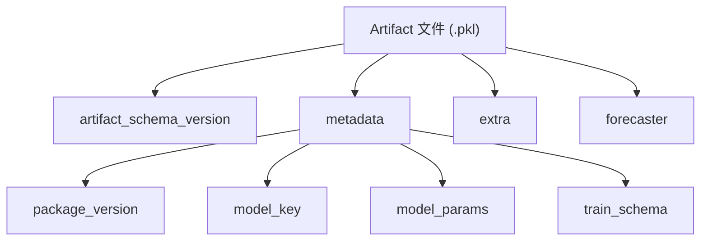

# 模型工件

模型工件（Artifact）是 ForeSight 对训练好的模型进行持久化的标准格式。它不仅保存模型对象本身，还记录版本信息、模型参数和训练 schema 等元数据，确保模型在保存、加载、迁移和审计过程中的可追溯性。

!!! info "何时需要工件"

    - 训练与预测分离（训练在 notebook，预测在生产服务）
    - 模型版本管理与对比
    - CI/CD 管道中的模型验证

---

## 工件结构



每个工件是一个通过 pickle 序列化的字典，包含以下顶层字段：

| 字段 | 类型 | 说明 |
|------|------|------|
| `artifact_schema_version` | `int` | Schema 版本号（当前为 `1`，兼容 legacy `0`） |
| `metadata` | `dict` | 模型元数据（版本、参数、训练 schema） |
| `extra` | `dict` | 用户自定义的附加信息 |
| `forecaster` | `BaseForecaster` / `BaseGlobalForecaster` | 训练好的模型对象 |

---

## 保存模型：save_forecaster

```python
from foresight import make_forecaster_object, save_forecaster

# 训练模型
model = make_forecaster_object("theta")
model.fit([112, 118, 132, 129, 121, 135, 148, 148, 136, 119, 104, 118])

# 保存为工件
metadata = save_forecaster(model, "model.pkl")
print(metadata)
```

返回的 `metadata` 字典包含：

```python
{
    "package_version": "0.x.y",
    "model_key": "theta",
    "model_params": {},
    "train_schema": { ... },
}
```

!!! tip "附加自定义信息"

    通过 `extra` 参数可以在工件中保存额外的上下文信息：

    ```python
    save_forecaster(model, "model.pkl", extra={
        "dataset": "monthly_sales",
        "trained_by": "pipeline_v2",
        "metrics": {"mae": 3.2, "rmse": 4.1},
    })
    ```

!!! warning "必须先 fit"

    `save_forecaster` 要求模型已经调用过 `fit`，否则会抛出 `RuntimeError`。

---

## 加载模型：load_forecaster

```python
from foresight import load_forecaster

model = load_forecaster("model.pkl")
yhat = model.predict(3)
print(yhat)
```

`load_forecaster` 直接返回 `BaseForecaster` 或 `BaseGlobalForecaster` 对象，可以立即用于预测。

---

## 加载完整工件：load_forecaster_artifact

如果需要访问元数据和自定义信息，使用 `load_forecaster_artifact`：

!!! warning "安全边界"

    Only load artifacts from trusted sources.

    `load_forecaster_artifact(...)` 会通过 Python pickle 反序列化完整工件载荷，
    而不只是读取元数据；恶意 artifact 在加载阶段就可能执行任意代码，因此只
    能用于可信来源的工件文件。

```python
from foresight import load_forecaster_artifact

artifact = load_forecaster_artifact("model.pkl")

print(artifact["artifact_schema_version"])  # 1
print(artifact["metadata"]["model_key"])    # "theta"
print(artifact["metadata"]["model_params"]) # {}
print(artifact["extra"])                    # 用户自定义信息

# 从工件中获取模型对象
model = artifact["forecaster"]
yhat = model.predict(3)
```

---

## Schema 版本控制

ForeSight 使用 `artifact_schema_version` 字段来管理工件格式的演进：

| 版本 | 说明 |
|------|------|
| `0` | Legacy 格式（无版本字段时自动识别为 `0`） |
| `1` | 当前版本，包含完整的 metadata、extra 和 schema version |

加载时会自动校验 schema 版本。如果遇到不支持的版本，系统会提示使用当前版本重新保存。

!!! note "向后兼容"

    使用旧版 ForeSight 保存的工件（schema version `0`）仍然可以被正常加载。加载器会自动补充缺失的 `artifact_schema_version` 字段。

---

## CLI 工件管理

ForeSight CLI 提供了一组用于工件检查和管理的子命令：

这些子命令都会加载 pickle 工件，因此只能用于可信来源的 artifact。

=== "查看工件信息"

    ```bash
    foresight artifact info --artifact model.pkl
    ```

    输出工件的元数据摘要，包括模型 key、参数、package 版本和训练 schema。

=== "验证工件"

    ```bash
    foresight artifact validate --artifact model.pkl
    ```

    检查工件文件的完整性：schema 版本是否受支持、必需字段是否齐全、模型对象是否可反序列化。

=== "对比工件"

    ```bash
    foresight artifact diff \
        --left-artifact model_v1.pkl \
        --right-artifact model_v2.pkl
    ```

    对比两个工件的 metadata 差异，用于追踪模型参数变更、版本升级等。

---

## CLI 工件预测

直接从已保存的工件文件生成预测，无需编写 Python 代码：

```bash
foresight forecast artifact --artifact model.pkl --horizon 6
```

该命令会加载工件中的模型对象并调用 `predict(horizon)` 输出预测结果。

!!! tip "生产集成"

    结合 `save_forecaster` 和 CLI 工件预测，可以实现训练与推理的完全分离：

    1. 训练脚本中 `save_forecaster(model, "model.pkl")`
    2. 生产环境中 `foresight forecast artifact --artifact model.pkl --horizon N`

---

## 完整示例：保存、加载与预测

```python
from foresight import (
    make_forecaster_object,
    save_forecaster,
    load_forecaster,
    load_forecaster_artifact,
)

# === 训练阶段 ===
model = make_forecaster_object("holt", alpha=0.3, beta=0.1)
model.fit([112, 118, 132, 129, 121, 135, 148, 148, 136, 119, 104, 118])

# 保存工件（附带评估指标）
metadata = save_forecaster(
    model,
    "holt_model.pkl",
    extra={"eval_mae": 5.3, "dataset": "airline"},
)
print("保存成功，metadata:", metadata)

# === 推理阶段 ===
loaded_model = load_forecaster("holt_model.pkl")
predictions = loaded_model.predict(6)
print("预测结果:", predictions)

# === 审计/检查 ===
artifact = load_forecaster_artifact("holt_model.pkl")
print("Schema 版本:", artifact["artifact_schema_version"])
print("模型:", artifact["metadata"]["model_key"])
print("ForeSight 版本:", artifact["metadata"]["package_version"])
print("附加信息:", artifact["extra"])
```

全局模型的保存与加载方式完全相同：

```python
from foresight import make_global_forecaster_object, save_forecaster, load_forecaster

global_model = make_global_forecaster_object("xgb-step-lag-global", lags=6)
global_model.fit(long_df)

save_forecaster(global_model, "global_model.pkl")

loaded = load_forecaster("global_model.pkl")
forecasts = loaded.predict(cutoff="2024-06-01", horizon=3)
```

---

## 下一步

- [调优与层级预测](tuning.md) -- 模型超参数调优和层级时间序列预测
- [全局模型](global-models.md) -- 了解全局模型的训练与使用
- [CLI 参考](../cli/index.md) -- 所有 CLI 子命令的完整文档
