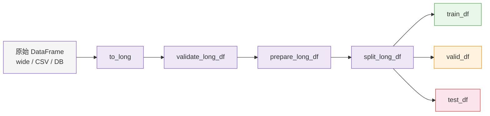

# 数据格式

ForeSight 采用 **长格式 (long format)** 作为核心数据标准。所有预测、评估和回测 API 都基于统一的三列结构：`unique_id`、`ds`、`y`。本页介绍如何将原始数据转换为长格式，并完成验证与预处理。

!!! info "为什么选择长格式？"

    长格式将每条观测值存储为独立的一行，天然支持多序列（面板数据）场景，
    且与 Prophet / Nixtla / statsforecast 等主流预测框架兼容。

---

## 什么是长格式

长格式 DataFrame 包含三个必需列：

| 列名 | 类型 | 说明 |
|---|---|---|
| `unique_id` | `string` | 序列标识符，如 `"region=north\|store=a"` |
| `ds` | `datetime` / `int` | 时间戳或有序索引 |
| `y` | `float` | 观测值（目标变量） |

示例：

```
unique_id    ds           y
store=a      2024-01-01   120.0
store=a      2024-01-02   135.0
store=b      2024-01-01    80.0
store=b      2024-01-02    92.0
```

---

## Wide → Long 转换

如果你的原始数据是宽格式（每列代表一个序列），可以使用 `to_long` 将其转换为长格式。

=== "使用 to_long"

    ```python
    from foresight.data.format import to_long

    # 原始宽格式 DataFrame
    # columns: date, store_a, store_b, region
    long_df = to_long(
        df,
        time_col="date",
        y_col="store_a",
        id_cols=["region"],       # 用于构建 unique_id
        x_cols=["temperature"],   # 协变量（可选）
    )
    print(long_df.head())
    # unique_id       ds           y     temperature
    # region=east     2024-01-01   120.0 5.2
    # region=east     2024-01-02   135.0 6.1
    ```

=== "使用 pandas pivot"

    ```python
    import pandas as pd

    wide_df = pd.DataFrame({
        "date": pd.date_range("2024-01-01", periods=4, freq="D"),
        "store_a": [120, 135, 128, 142],
        "store_b": [80, 92, 88, 95],
    })

    long_df = wide_df.melt(
        id_vars=["date"],
        var_name="unique_id",
        value_name="y",
    ).rename(columns={"date": "ds"})
    ```

### `to_long` 完整签名

```python
to_long(
    df: pd.DataFrame,
    *,
    time_col: str,          # 时间列名
    y_col: str,             # 目标值列名
    id_cols: Iterable[str] = (),         # 构成 unique_id 的列
    x_cols: Iterable[str] = (),          # 通用协变量
    historic_x_cols: Iterable[str] = (), # 仅历史协变量
    future_x_cols: Iterable[str] = (),   # 未来已知协变量
    static_cols: Iterable[str] = (),     # 静态特征列
    dropna: bool = True,                 # 丢弃含 NA 的行
    freq: str | None = None,             # 指定频率（如 "D", "W"）
    y_missing: str = "error",            # y 缺失策略
    x_missing: str = "error",            # 协变量缺失策略
    prepare: bool = False,               # 同时执行 prepare_long_df
) -> pd.DataFrame
```

!!! tip "一步到位"

    设置 `prepare=True` 可在转换的同时完成频率对齐和缺失值处理，省去后续单独调用 `prepare_long_df`。

---

## 验证：validate_long_df

转换完成后，使用 `validate_long_df` 检查数据是否符合长格式要求：

```python
from foresight.data.format import validate_long_df

validate_long_df(long_df)  # 通过则无输出，失败抛出异常
```

验证规则包括：

- [x] 包含 `unique_id`、`ds`、`y` 三列
- [x] DataFrame 非空
- [x] `unique_id` 和 `ds` 不含 `NA`
- [x] 每个 `unique_id` 内 `ds` 单调递增（`require_sorted=True`）
- [x] 每个 `unique_id` 内 `ds` 无重复（`require_unique_ds=True`）

```python
validate_long_df(
    long_df,
    require_sorted=True,      # 是否要求 ds 已排序
    require_unique_ds=True,   # 是否要求 ds 无重复
)
```

!!! warning "常见错误"

    如果 `validate_long_df` 抛出 `"ds is not sorted"` 错误，通常意味着数据在合并时打乱了顺序。
    可使用 `prepare_long_df` 自动排序，或手动调用 `df.sort_values(["unique_id", "ds"])`。

---

## 预处理：prepare_long_df

`prepare_long_df` 对长格式 DataFrame 进行排序、频率对齐和缺失值处理：

```python
from foresight.data.prep import prepare_long_df

prepared_df = prepare_long_df(
    long_df,
    freq="D",             # 指定频率；None 则自动推断
    strict_freq=False,    # True 时要求所有序列频率一致
    y_missing="ffill",    # y 缺失策略: error | drop | ffill | zero | interpolate
    x_missing="error",    # 协变量缺失策略
)
```

**缺失值策略说明：**

| 策略 | 行为 |
|---|---|
| `"error"` | 存在缺失时抛出异常（默认） |
| `"drop"` | 丢弃含缺失的行 |
| `"ffill"` | 向前填充 |
| `"zero"` | 用 0 填充 |
| `"interpolate"` | 线性插值（数值列）/ 向前填充（非数值列） |

!!! note "频率推断"

    当 `freq=None` 时，ForeSight 会对每个 `unique_id` 独立推断频率。
    如果推断失败且 `strict_freq=False`，则跳过该序列的频率对齐。

---

## 数据分割：split_long_df

使用 `split_long_df` 按时间顺序将数据拆分为训练集、验证集和测试集：

```python
from foresight.data.workflows import split_long_df

splits = split_long_df(
    long_df,
    test_size=12,         # 每个序列最后 12 个时间步作为测试集
    valid_size=6,         # 测试集前 6 个时间步作为验证集
    gap=0,                # 训练集与验证集之间的间隔
    min_train_size=1,     # 训练集最少行数
)

train_df = splits["train"]
valid_df = splits["valid"]
test_df  = splits["test"]
```

也支持按比例分割：

```python
splits = split_long_df(long_df, test_frac=0.2, valid_frac=0.1)
```

!!! tip "分割粒度"

    `split_long_df` 对每个 `unique_id` 独立执行分割，确保不同序列的训练 / 测试边界不会互相影响。

---

## 协变量处理

ForeSight 区分三种协变量角色：

| 角色 | 参数 | 说明 |
|---|---|---|
| 历史协变量 | `historic_x_cols` | 仅在训练期间可用 |
| 未来协变量 | `future_x_cols` | 在预测期间也已知（如节假日、促销计划） |
| 静态特征 | `static_cols` | 在序列内恒定（如门店类型、地理区域） |

使用 `resolve_covariate_roles` 可以自动解析和规范化协变量角色：

```python
from foresight.data.format import resolve_covariate_roles

historic, future, all_x = resolve_covariate_roles(
    x_cols=["temperature", "holiday"],
    future_x_cols=["holiday"],
)
# historic = ("temperature",)
# future  = ("holiday",)
# all_x   = ("temperature", "holiday")
```

---

## 逆向转换：long_to_wide

需要将结果转回宽格式时，使用 `long_to_wide`：

```python
from foresight.data.format import long_to_wide

wide_df = long_to_wide(long_df)
# 输出: ds | store_a | store_b
```

---

## 层级结构：build_hierarchy_spec

对于层级时间序列，使用 `build_hierarchy_spec` 从 ID 列自动构建父子关系：

```python
from foresight.data.format import build_hierarchy_spec

spec = build_hierarchy_spec(df, id_cols=["region", "store"])
# {
#   "total": ("region=north", "region=south"),
#   "region=north": ("region=north|store=a", "region=north|store=b"),
#   "region=south": ("region=south|store=c",),
# }
```

---

## 数据管道总览



---

## 下一步

数据准备完成后，进入 **[:octicons-arrow-right-24: 预测工作流](forecasting.md)** 学习如何使用函数式和对象式 API 生成预测。
