```mermaid
gantt
    title Rolling window 示意（max_train_size=6, horizon=3, step=3）
    dateFormat X
    axisFormat %s
    section Window 1
        训练数据          :done, w1t, 6, 12
        预测 & 评估       :active, w1p, 12, 15
    section Window 2
        训练数据          :done, w2t, 9, 15
        预测 & 评估       :active, w2p, 15, 18
    section Window 3
        训练数据          :done, w3t, 12, 18
        预测 & 评估       :active, w3p, 18, 21
```

# 评估与回测

ForeSight 提供基于 walk-forward 交叉验证的回测框架，可对任意注册模型执行可复现的性能评估。核心函数 `eval_model` 和 `eval_model_long_df` 返回统一的指标字典，方便模型间横向对比。

!!! info "前置条件"

    请先阅读 [数据格式](data-format.md)，了解 long-format DataFrame 的列规范（`unique_id`、`ds`、`y`）。

---

## Walk-forward 回测原理

Walk-forward（也称 rolling-origin 或 time-series cross-validation）是时间序列评估的标准方法。其核心思想是：

1. 在历史数据中选取一个训练窗口，训练模型
2. 在紧随其后的 `horizon` 步上生成预测
3. 将窗口向前滑动 `step` 步，重复上述过程

ForeSight 支持两种窗口模式：

- **Expanding window**（默认）：训练窗口从第一个观测值开始，随切分点向前不断扩大
- **Rolling window**：通过设置 `max_train_size` 固定训练窗口大小

```mermaid
gantt
    title Walk-forward 回测示意（expanding window, horizon=3, step=3）
    dateFormat X
    axisFormat %s
    section Window 1
        训练数据          :done, w1t, 0, 12
        预测 & 评估       :active, w1p, 12, 15
    section Window 2
        训练数据          :done, w2t, 0, 15
        预测 & 评估       :active, w2p, 15, 18
    section Window 3
        训练数据          :done, w3t, 0, 18
        预测 & 评估       :active, w3p, 18, 21
```



---

## eval_model：快速评估注册数据集

`eval_model` 直接接受数据集名称，自动加载并转换为 long-format，然后执行 walk-forward 回测。

```python
from foresight import eval_model

metrics = eval_model(
    model="theta",
    dataset="catfish",
    y_col="Total",
    horizon=3,
    step=3,
    min_train_size=12,
)
print(metrics["mae"])    # 汇总 MAE
print(metrics["smape"])  # 汇总 sMAPE
```

!!! tip "适用场景"

    当你使用 ForeSight 内置数据集（如 `catfish`、`air-passengers` 等）进行快速基准测试时，`eval_model` 是最便捷的入口。

---

## eval_model_long_df：评估自定义长格式数据

当你拥有自己的 DataFrame 时，使用 `eval_model_long_df` 直接传入数据进行评估。

```python
import pandas as pd
from foresight import eval_model_long_df

# 准备 long-format DataFrame（必须包含 unique_id, ds, y 列）
df = pd.read_csv("my_data.csv")

metrics = eval_model_long_df(
    model="naive-last",
    long_df=df,
    horizon=7,
    step=7,
    min_train_size=30,
)
```

!!! warning "多变量模型"

    多变量模型（interface 为 `multivariate`）不能使用 `eval_model_long_df`，请改用 `eval_multivariate_model_df`。

---

## eval_multivariate_model_df：多变量模型评估

对于 VAR、GraphWaveNet 等多变量模型，使用宽格式 DataFrame 和显式的目标列列表：

```python
from foresight.services.evaluation import eval_multivariate_model_df

result = eval_multivariate_model_df(
    model="var",
    df=wide_df,              # 宽格式，每行一个时间步
    target_cols=["temp", "humidity", "pressure"],
    horizon=5,
    step=5,
    min_train_size=50,
)

# 汇总指标
print(result["mae"], result["rmse"])

# 按目标列的细分指标
for col, m in result["target_metrics"].items():
    print(f"  {col}: MAE={m['mae']:.4f}")
```

---

## eval_hierarchical_forecast_df：层级预测调和评估

对已生成的预测表进行层级调和并检查一致性：

```python
from foresight.services.evaluation import eval_hierarchical_forecast_df

result = eval_hierarchical_forecast_df(
    forecast_df=forecast_df,
    hierarchy=hierarchy_spec,
    method="bottom_up",
)
print(result["is_consistent"])       # True/False
print(result["n_inconsistencies"])   # 不一致节点数
```

---

## 返回值结构

`eval_model` 和 `eval_model_long_df` 返回统一的指标字典：

```python
{
    "model": "theta",
    "horizon": 3,
    "step": 3,
    "min_train_size": 12,
    "max_windows": None,
    "max_train_size": None,
    "n_series": 1,
    "n_series_skipped": 0,
    "n_windows": 5,
    "n_points": 15,
    # 汇总指标
    "mae": 1234.56,
    "rmse": 1567.89,
    "mape": 0.12,
    "smape": 0.11,
    # 按预测步的指标列表（长度 = horizon）
    "mae_by_step": [1100.0, 1250.0, 1350.0],
    "rmse_by_step": [1400.0, 1550.0, 1700.0],
    "mape_by_step": [0.10, 0.12, 0.14],
    "smape_by_step": [0.09, 0.11, 0.13],
}
```

| 字段 | 类型 | 说明 |
|------|------|------|
| `mae` | `float` | Mean Absolute Error |
| `rmse` | `float` | Root Mean Squared Error |
| `mape` | `float` | Mean Absolute Percentage Error |
| `smape` | `float` | Symmetric MAPE |
| `*_by_step` | `list[float]` | 每个预测步的对应指标，长度等于 `horizon` |
| `n_windows` | `int` | 实际执行的 walk-forward 窗口数 |
| `n_points` | `int` | 评估的数据点总数 |
| `n_series` | `int` | 处理的序列总数 |
| `n_series_skipped` | `int` | 因长度不足被跳过的序列数 |

---

## Expanding vs Rolling Window

=== "Expanding window（默认）"

    训练窗口从序列起点开始，随窗口推进不断扩大。适用于数据量有限、希望尽可能利用所有历史信息的场景。

    ```python
    metrics = eval_model(
        model="ets",
        dataset="air-passengers",
        y_col="Passengers",
        horizon=12,
        step=12,
        min_train_size=36,
        # max_train_size 不设置 → expanding window
    )
    ```

=== "Rolling window"

    通过 `max_train_size` 固定训练窗口大小。适用于数据具有概念漂移（concept drift）、旧数据可能降低预测质量的场景。

    ```python
    metrics = eval_model(
        model="ets",
        dataset="air-passengers",
        y_col="Passengers",
        horizon=12,
        step=12,
        min_train_size=36,
        max_train_size=60,  # 固定使用最近 60 个观测值
    )
    ```



---

## 限制窗口数量：max_windows

当数据非常长时，walk-forward 可能产生大量窗口。使用 `max_windows` 限制窗口数量以加速评估：

```python
metrics = eval_model_long_df(
    model="arima",
    long_df=df,
    horizon=7,
    step=1,
    min_train_size=30,
    max_windows=10,  # 只取最早的 10 个窗口
)
print(f"实际窗口数: {metrics['n_windows']}")
```

!!! note "窗口选择策略"

    `max_windows` 采用 `keep="first"` 策略，即保留**最早**的窗口。`max_windows` 必须 >= 1。

---

## Conformal 预测区间

在评估过程中，可通过 `conformal_levels` 参数同时计算 conformal prediction interval 的覆盖率和宽度：

```python
metrics = eval_model_long_df(
    model="theta",
    long_df=df,
    horizon=7,
    step=7,
    min_train_size=30,
    conformal_levels=[0.8, 0.9],   # 80% 和 90% 区间
    conformal_per_step=True,        # 按预测步分别计算（默认）
)

# conformal 相关字段会自动追加到返回字典中
print(metrics.get("conformal_coverage_80"))
print(metrics.get("conformal_width_80"))
```

!!! tip "接受多种格式"

    `conformal_levels` 接受 `(0, 1)` 范围的浮点数（如 `0.8`）或百分比整数（如 `80`），也可传入逗号分隔的字符串（如 `"80,90"`）。

---

## 完整参数表

### eval_model

| 参数 | 类型 | 必填 | 默认值 | 说明 |
|------|------|:----:|--------|------|
| `model` | `str` | :material-check: | — | 注册模型名称 |
| `dataset` | `str` | :material-check: | — | 内置数据集名称 |
| `horizon` | `int` | :material-check: | — | 预测步长 |
| `step` | `int` | :material-check: | — | 窗口滑动步长 |
| `min_train_size` | `int` | :material-check: | — | 最小训练窗口大小 |
| `y_col` | `str \| None` | | `None` | 数据集中目标列名 |
| `model_params` | `dict \| None` | | `None` | 模型超参数 |
| `max_windows` | `int \| None` | | `None` | 最大窗口数限制 |
| `max_train_size` | `int \| None` | | `None` | 固定训练窗口大小（rolling window） |
| `conformal_levels` | `Any` | | `None` | Conformal 区间水平，如 `[0.8, 0.9]` |
| `conformal_per_step` | `bool` | | `True` | 是否按预测步分别计算 conformal 区间 |

### eval_model_long_df

| 参数 | 类型 | 必填 | 默认值 | 说明 |
|------|------|:----:|--------|------|
| `model` | `str` | :material-check: | — | 注册模型名称 |
| `long_df` | `DataFrame` | :material-check: | — | 长格式 DataFrame（`unique_id`、`ds`、`y`） |
| `horizon` | `int` | :material-check: | — | 预测步长 |
| `step` | `int` | :material-check: | — | 窗口滑动步长 |
| `min_train_size` | `int` | :material-check: | — | 最小训练窗口大小 |
| `model_params` | `dict \| None` | | `None` | 模型超参数 |
| `max_windows` | `int \| None` | | `None` | 最大窗口数限制 |
| `max_train_size` | `int \| None` | | `None` | 固定训练窗口大小 |
| `conformal_levels` | `Any` | | `None` | Conformal 区间水平 |
| `conformal_per_step` | `bool` | | `True` | 按预测步分别计算 |

---

## 下一步

- [模型选择](models.md) — 了解 250+ 注册模型的能力和适用场景
- [概率预测](intervals.md) — Bootstrap、conformal、分位数回归三种区间估计方法
- [全局模型](global-models.md) — 面板数据上的全局训练与评估
