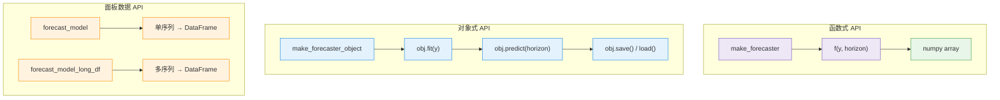
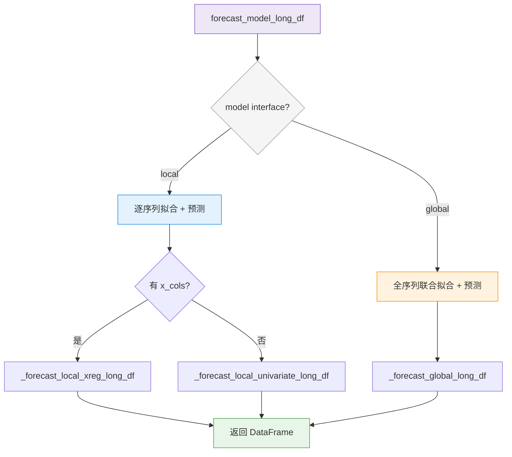

# 预测工作流

ForeSight 提供两种风格的预测 API：**函数式** 和 **对象式**。函数式 API 适合一次性预测场景，对象式 API 适合需要持久化和增量更新的生产环境。本页介绍两种风格的使用方法，以及面板数据（long DataFrame）预测的完整流程。

!!! info "前置条件"

    请先阅读 [数据格式](data-format.md) 了解长格式 DataFrame 的要求。

---

## 两种 API 风格



---

## 函数式 API：make_forecaster

`make_forecaster` 返回一个无状态的可调用对象。传入历史序列和预测步长，直接返回 numpy array：

```python
from foresight import make_forecaster

f = make_forecaster("theta", theta=2.0)
yhat = f([112, 118, 132, 129, 121, 135, 148, 148], horizon=4)
print(yhat)  # array([...])  — 4 个预测值
```

**适用场景：** 脚本、Notebook 实验、无需保存模型的快速验证。

!!! note "无状态"

    每次调用 `f(y, horizon)` 都是独立的——内部会重新拟合模型。如果需要避免重复拟合，请使用对象式 API。

---

## 对象式 API：make_forecaster_object

`make_forecaster_object` 返回一个实现了 `fit` / `predict` / `save` / `load` 接口的 `BaseForecaster` 对象：

```python
from foresight import make_forecaster_object

obj = make_forecaster_object("holt", alpha=0.3, beta=0.1)

# 1. 拟合
obj.fit([112, 118, 132, 129, 121, 135, 148, 148])

# 2. 预测
yhat = obj.predict(4)
print(yhat)  # array([...])

# 3. 持久化
obj.save("model_holt.pkl")

# 4. 加载
from foresight import make_forecaster_object
loaded = make_forecaster_object("holt")
loaded.load("model_holt.pkl")
yhat2 = loaded.predict(4)
```

**适用场景：** 生产部署、模型版本管理、增量预测。

---

## 全局模型 API

对于跨序列训练的全局模型（如 LightGBM、N-BEATS），使用对应的全局 API：

=== "函数式"

    ```python
    from foresight import make_global_forecaster

    gf = make_global_forecaster("lightgbm", n_estimators=100)
    pred_df = gf(long_df, horizon=12)
    ```

=== "对象式"

    ```python
    from foresight import make_global_forecaster_object

    gobj = make_global_forecaster_object("lightgbm", n_estimators=100)
    gobj.fit(long_df)
    pred_df = gobj.predict(cutoff, horizon=12)
    ```

!!! tip "多变量预测"

    对于多变量输入模型，使用 `make_multivariate_forecaster`：

    ```python
    from foresight import make_multivariate_forecaster

    mvf = make_multivariate_forecaster("var", maxlags=4)
    yhat = mvf(wide_df, horizon=6)
    ```

---

## 单序列预测：forecast_model

`forecast_model` 接收一维数组，返回包含预测结果的 DataFrame：

```python
from foresight import forecast_model

result = forecast_model(
    model="theta",
    y=[112, 118, 132, 129, 121, 135, 148, 148],
    horizon=4,
    ds=pd.date_range("2024-01-01", periods=8, freq="MS"),  # 可选
    model_params={"theta": 2.0},
)
print(result)
```

输出 DataFrame 结构：

```
unique_id   ds           cutoff       step  yhat     model
series=0    2024-09-01   2024-08-01   1     151.2    theta
series=0    2024-10-01   2024-08-01   2     154.8    theta
series=0    2024-11-01   2024-08-01   3     157.1    theta
series=0    2024-12-01   2024-08-01   4     160.3    theta
```

!!! note "ds 参数"

    当省略 `ds` 时，ForeSight 使用整数索引。如果 `y` 是带 DatetimeIndex 的 `pd.Series`，会自动使用其索引。

---

## 面板数据预测：forecast_model_long_df

`forecast_model_long_df` 是面板数据预测的核心函数，对长格式 DataFrame 中的每个序列执行预测：

```python
from foresight import forecast_model_long_df

pred = forecast_model_long_df(
    model="theta",
    long_df=train_df,
    horizon=12,
    model_params={"theta": 2.0},
    interval_levels=[0.80, 0.95],        # 可选：置信区间
    interval_samples=1000,                # Bootstrap 采样次数
)
print(pred.columns.tolist())
# ['unique_id', 'ds', 'cutoff', 'step', 'yhat',
#  'yhat_lo_80', 'yhat_hi_80', 'yhat_lo_95', 'yhat_hi_95', 'model']
```

### 参数说明

| 参数 | 类型 | 默认值 | 说明 |
|---|---|---|---|
| `model` | `str` | *必填* | 模型名称（如 `"theta"`、`"ets"`、`"lightgbm"`） |
| `long_df` | `pd.DataFrame` | *必填* | 长格式 DataFrame（`unique_id`, `ds`, `y`） |
| `future_df` | `pd.DataFrame \| None` | `None` | 包含未来时间步协变量的 DataFrame |
| `horizon` | `int` | *必填* | 预测步长 |
| `model_params` | `dict \| None` | `None` | 模型超参数 |
| `interval_levels` | `list[float] \| None` | `None` | 置信区间水平（如 `[0.80, 0.95]`） |
| `interval_min_train_size` | `int \| None` | `None` | Bootstrap 最小训练窗口；默认 `min(24, n-1)` |
| `interval_samples` | `int` | `1000` | Bootstrap 采样次数 |
| `interval_seed` | `int \| None` | `None` | 随机种子（保证可复现） |

### 输出列

| 列名 | 说明 |
|---|---|
| `unique_id` | 序列标识符 |
| `ds` | 预测时间戳 |
| `cutoff` | 训练数据最后一个时间戳 |
| `step` | 预测步数（从 1 开始） |
| `yhat` | 点预测值 |
| `yhat_lo_XX` / `yhat_hi_XX` | 置信区间下界 / 上界（仅当指定 `interval_levels` 时） |
| `model` | 模型名称 |

### 带协变量的预测

当模型支持外生变量时，通过 `model_params` 中的 `x_cols` 指定协变量列，并通过 `future_df` 提供未来值：

```python
pred = forecast_model_long_df(
    model="sarimax",
    long_df=long_df,          # 包含 y + 协变量列
    future_df=future_df,      # 包含未来时间步的协变量值
    horizon=6,
    model_params={
        "x_cols": ["temperature", "holiday"],
    },
)
```

!!! warning "协变量完整性"

    使用 `x_cols` 时，`long_df` 中观测期的协变量不能有缺失值，
    `future_df` 中也必须包含至少 `horizon` 步的协变量值。

---

## 完整示例

以下展示从数据准备到预测的完整流程：

```python
import pandas as pd
from foresight.data.format import to_long, validate_long_df
from foresight.data.prep import prepare_long_df
from foresight.data.workflows import split_long_df
from foresight import forecast_model_long_df

# 1. 转换为长格式
long_df = to_long(raw_df, time_col="date", y_col="sales", id_cols=["store"])

# 2. 验证
validate_long_df(long_df)

# 3. 预处理
prepared = prepare_long_df(long_df, freq="D", y_missing="ffill")

# 4. 分割
splits = split_long_df(prepared, test_size=30)
train_df = splits["train"]

# 5. 预测
pred = forecast_model_long_df(
    model="theta",
    long_df=train_df,
    horizon=30,
    interval_levels=[0.95],
)

print(pred.head())
```

---

## Local vs Global 模型路由

`forecast_model_long_df` 内部根据模型的 `interface` 属性自动选择执行路径：



- **Local 模型**（如 `theta`、`ets`、`sarimax`）：对每个 `unique_id` 独立拟合和预测。
- **Global 模型**（如 `lightgbm`、`nbeats`）：在所有序列上联合训练一个模型。

---

## 下一步

预测完成后，进入 **[:octicons-arrow-right-24: 评估与回测](evaluation.md)** 学习如何使用滚动窗口回测和交叉验证评估模型性能。
