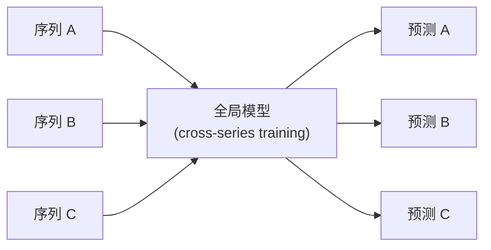

# 全局模型

全局模型（Global Models）通过跨序列联合训练，从多条时间序列中共享学习规律，适用于面板数据（panel data）场景。与局部模型每条序列独立拟合不同，全局模型能够利用序列间的共性特征，在数据量有限时表现尤为出色。

!!! info "前置条件"

    全局模型依赖 ML/树模型后端，请确保已安装对应 extras：

    ```bash
    pip install foresight-ts[ml,xgb]
    ```

---

## 什么是全局模型



传统的局部模型为每条序列单独拟合一个模型；全局模型则将所有序列的特征（滞后值、协变量、静态元数据等）拼成一张训练表，训练一个统一的模型。其核心优势包括：

- **数据高效** — 短序列也能受益于其他序列的模式
- **自动特征工程** — step-lag 框架自动构建滞后特征
- **协变量支持** — 可传入外部回归变量和序列级元数据

---

## 数据要求：Long Format

全局模型要求输入数据为 **long format DataFrame**，必须包含以下三列：

| 列名 | 说明 |
|------|------|
| `unique_id` | 序列标识符，区分不同时间序列 |
| `ds` | 时间戳列 |
| `y` | 目标值列 |

```python
import pandas as pd

long_df = pd.DataFrame({
    "unique_id": ["store_1"] * 6 + ["store_2"] * 6,
    "ds": pd.date_range("2024-01-01", periods=6, freq="MS").tolist() * 2,
    "y": [100, 120, 130, 125, 140, 150, 200, 210, 220, 215, 230, 245],
})
```

!!! tip "数据排序"

    ForeSight 内部会自动按 `unique_id` 和 `ds` 排序，但提前排好序可以避免不必要的开销。

---

## 创建与使用

ForeSight 提供两种创建全局模型的方式：

=== "对象式 API（推荐）"

    `make_global_forecaster_object` 返回一个 `BaseGlobalForecaster` 实例，支持 `fit` / `predict` 生命周期：

    ```python
    from foresight import make_global_forecaster_object

    model = make_global_forecaster_object(
        "xgb-step-lag-global",
        n_estimators=200,
        max_depth=6,
        lags=12,
    )

    # 训练：传入 long format DataFrame
    model.fit(long_df)

    # 预测：指定截断点和预测步数
    forecasts = model.predict(cutoff="2024-06-01", horizon=3)
    ```

    `predict` 返回一个 DataFrame，包含每条序列的未来预测值。

=== "函数式 API"

    `make_global_forecaster` 返回一个可调用对象（`GlobalForecasterFn`），一步完成训练与预测：

    ```python
    from foresight import make_global_forecaster

    f = make_global_forecaster(
        "xgb-step-lag-global",
        n_estimators=200,
        max_depth=6,
        lags=12,
    )

    # 传入 long_df、截断点和 horizon 直接获取预测结果
    forecasts = f(long_df, cutoff="2024-06-01", horizon=3)
    ```

---

## 协变量支持

全局模型支持三类外部信息：

| 参数 | 类型 | 说明 |
|------|------|------|
| `x_cols` | future covariates | 已知未来值的协变量（如节假日、促销标记），需在预测期也提供 |
| `historic_x_cols` | historic covariates | 仅在历史期可用的协变量 |
| `static_cols` | static features | 序列级元数据（如门店类型、地区），每条序列一个固定值 |

```python
# 带协变量的 long DataFrame
long_df["is_holiday"] = [0, 0, 0, 1, 0, 0] * 2     # future covariate
long_df["store_type"] = ["A"] * 6 + ["B"] * 6        # static feature

model = make_global_forecaster_object(
    "lgbm-step-lag-global",
    lags=6,
    x_cols=["is_holiday"],
    static_cols=["store_type"],
)
model.fit(long_df)
```

!!! warning "Future Covariates 注意事项"

    使用 `x_cols` 时，`predict` 阶段也需要提供未来时刻对应的协变量值。确保预测期的 DataFrame 中包含这些列。

---

## 预测：forecast_model_long_df

`forecast_model_long_df` 会自动检测模型是否为全局模型，并使用对应的接口进行预测：

```python
from foresight import forecast_model_long_df

result = forecast_model_long_df(
    model="xgb-step-lag-global",
    long_df=long_df,
    horizon=3,
)
```

---

## 评估：eval_model_long_df

`eval_model_long_df` 同样自动适配全局模型，执行 walk-forward 交叉验证：

```python
from foresight import eval_model_long_df

metrics = eval_model_long_df(
    model="xgb-step-lag-global",
    long_df=long_df,
    horizon=3,
    step=3,
    min_train_size=6,
)
print(metrics)
```

!!! note "全局评估的特殊之处"

    全局模型评估时，每个窗口会使用所有序列的历史数据联合训练，然后对所有序列分别生成预测并计算指标。

---

## 可用的全局模型

ForeSight 提供丰富的全局模型家族，均基于 step-lag 特征工程框架：

=== "树模型 / Boosting"

    | 模型 key | 后端 | Extra |
    |----------|------|-------|
    | `xgb-step-lag-global` | XGBoost | `xgb` |
    | `lgbm-step-lag-global` | LightGBM | `lgbm` |
    | `catboost-step-lag-global` | CatBoost | `catboost` |
    | `rf-step-lag-global` | RandomForest | `ml` |
    | `extra-trees-step-lag-global` | ExtraTrees | `ml` |
    | `gbrt-step-lag-global` | GradientBoosting | `ml` |
    | `hgb-step-lag-global` | HistGradientBoosting | `ml` |
    | `adaboost-step-lag-global` | AdaBoost | `ml` |
    | `bagging-step-lag-global` | Bagging | `ml` |
    | `decision-tree-step-lag-global` | DecisionTree | `ml` |

=== "线性模型"

    | 模型 key | 后端 | Extra |
    |----------|------|-------|
    | `ridge-step-lag-global` | Ridge | `ml` |
    | `lasso-step-lag-global` | Lasso | `ml` |
    | `elasticnet-step-lag-global` | ElasticNet | `ml` |
    | `bayesian-ridge-step-lag-global` | BayesianRidge | `ml` |
    | `ard-step-lag-global` | ARD | `ml` |
    | `huber-step-lag-global` | HuberRegressor | `ml` |
    | `sgd-step-lag-global` | SGDRegressor | `ml` |
    | `passive-aggressive-step-lag-global` | PassiveAggressive | `ml` |
    | `omp-step-lag-global` | OMP | `ml` |

=== "其他"

    | 模型 key | 后端 | Extra |
    |----------|------|-------|
    | `knn-step-lag-global` | KNeighbors | `ml` |
    | `svr-step-lag-global` | SVR | `ml` |
    | `linear-svr-step-lag-global` | LinearSVR | `ml` |
    | `kernel-ridge-step-lag-global` | KernelRidge | `ml` |
    | `mlp-step-lag-global` | MLPRegressor | `ml` |
    | `quantile-step-lag-global` | QuantileRegressor | `ml` |

=== "XGBoost 变体"

    | 模型 key | 损失函数 |
    |----------|---------|
    | `xgb-mae-step-lag-global` | MAE |
    | `xgb-huber-step-lag-global` | Huber |
    | `xgb-poisson-step-lag-global` | Poisson |
    | `xgb-gamma-step-lag-global` | Gamma |
    | `xgb-tweedie-step-lag-global` | Tweedie |
    | `xgb-dart-step-lag-global` | DART |
    | `xgb-linear-step-lag-global` | Linear booster |
    | `xgbrf-step-lag-global` | XGBoost RF |

此外，ForeSight 也支持基于 PyTorch 的全局模型（需安装 `torch` extra）。

---

## 完整示例：XGBoost 全局模型

```python
import pandas as pd
from foresight import make_global_forecaster_object, eval_model_long_df

# 1. 准备面板数据
long_df = pd.DataFrame({
    "unique_id": ["A"] * 24 + ["B"] * 24 + ["C"] * 24,
    "ds": pd.date_range("2022-01-01", periods=24, freq="MS").tolist() * 3,
    "y": [
        # 序列 A：上升趋势
        *range(100, 124),
        # 序列 B：季节性
        *[50 + 10 * (i % 4) for i in range(24)],
        # 序列 C：平稳
        *[200] * 24,
    ],
})

# 2. 创建并训练全局模型
model = make_global_forecaster_object(
    "xgb-step-lag-global",
    n_estimators=100,
    lags=6,
)
model.fit(long_df)

# 3. 生成预测
forecasts = model.predict(cutoff="2023-12-01", horizon=3)
print(forecasts)

# 4. 评估模型
metrics = eval_model_long_df(
    model="xgb-step-lag-global",
    long_df=long_df,
    horizon=3,
    step=3,
    min_train_size=12,
)
print(metrics)
```

---

## 下一步

- [异常检测](anomaly-detection.md) -- 使用统计方法或预测残差检测时间序列中的异常点
- [模型工件](artifacts.md) -- 保存和加载训练好的模型
- [评估与回测](evaluation.md) -- 深入了解 walk-forward 评估策略
