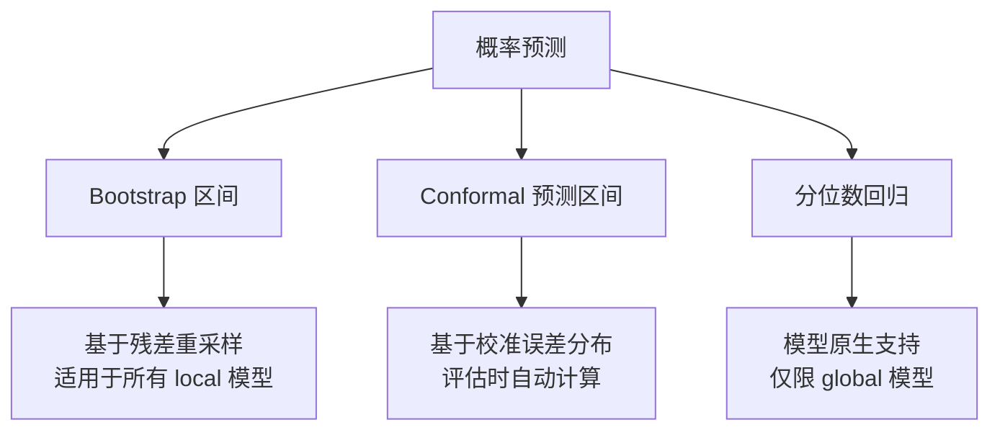

# 概率预测

点预测只给出未来的期望值，而概率预测（probabilistic forecasting）还提供预测区间，量化预测的不确定性。ForeSight 支持三种区间估计方法：**Bootstrap**、**Conformal prediction** 和**分位数回归**。

!!! info "前置条件"

    请先阅读 [评估与回测](evaluation.md) 了解 walk-forward 回测的基本概念，以及 [模型选择](models.md) 了解不同模型的能力。

---

## 三种方法概览



| 方法 | 原理 | 适用范围 | 入口 |
|------|------|---------|------|
| Bootstrap | 从 walk-forward 残差中重采样，叠加到点预测上 | 所有 local 模型 | `bootstrap_intervals`、`forecast_model` 的 `interval_levels` |
| Conformal | 利用评估阶段的预测误差分布构建非参数区间 | 评估过程中自动计算 | `eval_model_long_df` 的 `conformal_levels` |
| 分位数回归 | 模型直接预测指定分位数 | 支持 `supports_interval_forecast` 的 global 模型 | `forecast_model_long_df` 的 `interval_levels` + 模型 `quantiles` 参数 |

---

## Bootstrap 区间

### 原理

Bootstrap 预测区间的核心步骤：

1. 在训练数据上执行 1-step walk-forward，收集残差序列
2. 从残差中有放回地重采样 `n_samples` 组，每组长度为 `horizon`
3. 将采样残差叠加到点预测上，得到 `n_samples` 条预测路径
4. 取指定分位数作为区间上下界

### bootstrap_intervals API

`bootstrap_intervals` 是底层函数，对单条序列生成区间：

```python
from foresight import make_forecaster
from foresight.intervals import bootstrap_intervals

f = make_forecaster("theta")
train = [112, 118, 132, 129, 121, 135, 148, 148, 136, 119, 104, 118,
         115, 126, 141, 135, 125, 149, 170, 170, 158, 133, 114, 140]

result = bootstrap_intervals(
    train,
    horizon=6,
    forecaster=f,
    min_train_size=12,
    n_samples=2000,
    quantiles=(0.1, 0.9),  # 80% 区间
    seed=42,
)

print(result["yhat"])     # shape: (6,)  点预测
print(result["lower"])    # shape: (6,)  下界（10th percentile）
print(result["upper"])    # shape: (6,)  上界（90th percentile）
print(result["n_samples"])  # 2000
```

!!! note "返回值结构"

    ```python
    {
        "yhat": np.ndarray,      # 点预测，shape (horizon,)
        "lower": np.ndarray,     # 下界，shape (horizon,)
        "upper": np.ndarray,     # 上界，shape (horizon,)
        "quantiles": (0.1, 0.9), # 使用的分位数
        "n_samples": 2000,       # 重采样次数
    }
    ```

### bootstrap_intervals 参数表

| 参数 | 类型 | 必填 | 默认值 | 说明 |
|------|------|:----:|--------|------|
| `train` | array-like | :material-check: | — | 一维训练序列 |
| `horizon` | `int` | :material-check: | — | 预测步长 |
| `forecaster` | `Callable` | :material-check: | — | 预测函数，签名 `(train, horizon) -> ndarray` |
| `min_train_size` | `int` | :material-check: | — | 残差收集时的最小训练窗口 |
| `n_samples` | `int` | | `1000` | 重采样次数 |
| `quantiles` | `tuple[float, float]` | | `(0.1, 0.9)` | 下界和上界分位数 |
| `seed` | `int \| None` | | `None` | 随机种子 |

---

## forecast_model / forecast_model_long_df 的 interval_levels

在预测 API 中，通过 `interval_levels` 参数可以直接获得带区间的预测结果，无需手动调用 `bootstrap_intervals`。

=== "单序列：forecast_model"

    ```python
    from foresight import forecast_model

    pred_df = forecast_model(
        model="theta",
        y=[112, 118, 132, 129, 121, 135, 148, 148, 136, 119, 104, 118,
           115, 126, 141, 135, 125, 149, 170, 170, 158, 133, 114, 140],
        horizon=6,
        interval_levels=[0.8, 0.95],     # 80% 和 95% 区间
        interval_min_train_size=12,
        interval_samples=2000,
        interval_seed=42,
    )
    print(pred_df.columns.tolist())
    # ['unique_id', 'ds', 'yhat', 'yhat_lo_80', 'yhat_hi_80', 'yhat_lo_95', 'yhat_hi_95']
    ```

=== "面板数据：forecast_model_long_df"

    ```python
    from foresight import forecast_model_long_df

    pred_df = forecast_model_long_df(
        model="naive-last",
        long_df=df,                        # long-format DataFrame
        horizon=7,
        interval_levels=[0.8, 0.9],
        interval_min_train_size=20,
        interval_samples=1000,
        interval_seed=42,
    )
    # 结果 DataFrame 自动包含 yhat_lo_80, yhat_hi_80, yhat_lo_90, yhat_hi_90 列
    print(pred_df[["unique_id", "ds", "yhat", "yhat_lo_80", "yhat_hi_80"]].head())
    ```

!!! tip "列命名规则"

    区间列的命名格式为 `yhat_lo_{level}` 和 `yhat_hi_{level}`，其中 `level` 是百分比整数。例如 `interval_levels=[0.8]` 会生成 `yhat_lo_80` 和 `yhat_hi_80`。

### interval 参数表

| 参数 | 类型 | 默认值 | 说明 |
|------|------|--------|------|
| `interval_levels` | `list[float] \| None` | `None` | 区间水平列表，如 `[0.8, 0.95]` |
| `interval_min_train_size` | `int \| None` | `None` | Bootstrap 残差收集的最小训练窗口；`None` 时自动设为 `max(2, n_obs // 3)` |
| `interval_samples` | `int` | `1000` | Bootstrap 重采样次数 |
| `interval_seed` | `int \| None` | `None` | 随机种子 |

---

## Conformal 预测区间

Conformal prediction interval 是一种基于校准误差分布的非参数方法，在 ForeSight 中作为**评估过程的附加输出**提供。

### 原理

1. 在 walk-forward 回测中，每个窗口产生 `horizon` 个预测误差
2. 按预测步（`conformal_per_step=True`）或整体汇总误差分布
3. 根据指定 `conformal_levels` 计算区间宽度和覆盖率

### 使用方式

在 `eval_model_long_df`（或 `eval_model`）中传入 `conformal_levels`：

```python
from foresight import eval_model_long_df

metrics = eval_model_long_df(
    model="theta",
    long_df=df,
    horizon=7,
    step=7,
    min_train_size=30,
    conformal_levels=[0.8, 0.9],   # 80% 和 90% conformal 区间
    conformal_per_step=True,        # 按预测步分别计算
)

# 返回值中自动包含 conformal 相关字段
print(metrics.get("conformal_coverage_80"))   # 实际覆盖率
print(metrics.get("conformal_width_80"))      # 平均区间宽度
```

!!! warning "仅在评估时可用"

    Conformal 区间依赖回测过程中的误差分布，因此只在 `eval_model` / `eval_model_long_df` 中可用，不能用于 `forecast_model`。如需预测时的区间，请使用 bootstrap（`interval_levels`）或分位数回归。

---

## 分位数回归

部分 global 模型原生支持分位数预测（通过模型能力标记 `supports_interval_forecast`）。这类模型在训练时直接优化分位数损失函数，预测时输出指定分位数的值。

### 使用方式

对支持分位数回归的 global 模型，`forecast_model_long_df` 的 `interval_levels` 会自动转换为对应的分位数并合并到模型的 `quantiles` 参数中：

```python
from foresight import forecast_model_long_df

pred_df = forecast_model_long_df(
    model="lightgbm-step-lag-global",   # global 模型，支持分位数回归
    long_df=df,
    horizon=7,
    interval_levels=[0.8, 0.9],         # 自动映射为 quantiles
    model_params={
        "quantiles": [0.1, 0.5, 0.9],  # 也可直接指定额外分位数
    },
)
# 结果包含 yhat_lo_80, yhat_hi_80, yhat_lo_90, yhat_hi_90
# 以及 yhat_p10, yhat_p50, yhat_p90 等分位数列
```

!!! tip "分位数 vs Bootstrap"

    对于 global 模型，分位数回归通常比 bootstrap 更高效、更准确，因为区间是模型在训练过程中联合学习的，而非事后从残差中估计。

---

## 方法对比

| 特性 | Bootstrap | Conformal | 分位数回归 |
|------|-----------|-----------|-----------|
| 适用模型 | 所有 local 模型 | 所有模型（评估阶段） | 支持 `supports_interval_forecast` 的 global 模型 |
| 计算阶段 | 预测时 | 评估时 | 预测时（训练阶段联合优化） |
| 计算开销 | 中（需重采样） | 低（附加统计） | 低（模型原生输出） |
| 区间质量 | 取决于残差分布假设 | 理论覆盖率保证 | 取决于模型拟合质量 |
| API 入口 | `interval_levels` in `forecast_model` | `conformal_levels` in `eval_model_long_df` | `interval_levels` in `forecast_model_long_df` |

---

## 完整示例：Bootstrap 区间可视化

```python
import matplotlib.pyplot as plt
from foresight import make_forecaster
from foresight.intervals import bootstrap_intervals

# 准备数据
train = [112, 118, 132, 129, 121, 135, 148, 148, 136, 119, 104, 118,
         115, 126, 141, 135, 125, 149, 170, 170, 158, 133, 114, 140]
horizon = 6
f = make_forecaster("theta")

# 生成区间
result = bootstrap_intervals(
    train,
    horizon=horizon,
    forecaster=f,
    min_train_size=12,
    n_samples=2000,
    quantiles=(0.1, 0.9),
    seed=42,
)

# 可视化
fig, ax = plt.subplots(figsize=(10, 4))
x_hist = range(len(train))
x_pred = range(len(train), len(train) + horizon)

ax.plot(x_hist, train, "k-", label="历史数据")
ax.plot(x_pred, result["yhat"], "b-o", label="点预测")
ax.fill_between(x_pred, result["lower"], result["upper"],
                alpha=0.3, color="blue", label="80% 区间")
ax.legend()
ax.set_title("Bootstrap 预测区间")
plt.tight_layout()
plt.show()
```

---

## 下一步

- [全局模型](global-models.md) — 面板数据上的 global 训练，包括分位数回归的深入用法
- [评估与回测](evaluation.md) — conformal 区间的更多评估参数
- [调优与层级预测](tuning.md) — 超参数搜索与层级调和
