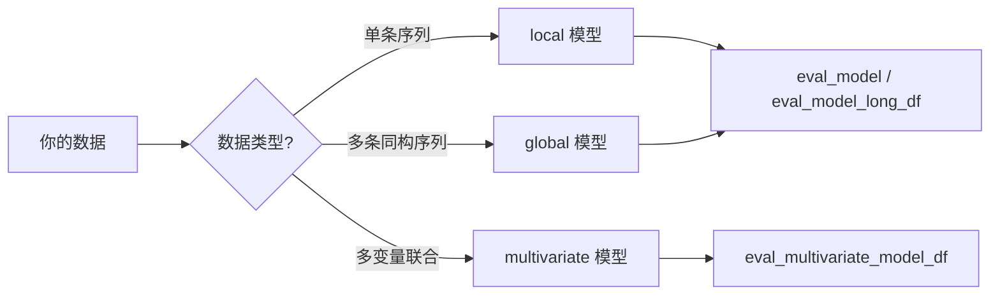

# 模型选择

ForeSight 内置 250+ 注册模型，涵盖从简单基线到深度学习的全谱系方法。本页帮助你理解各类模型的特点、安装要求和适用场景，并快速找到最合适的模型。

!!! info "前置条件"

    如需使用统计/ML/深度学习模型，请先安装对应的 [可选依赖](../getting-started/installation.md)。

---

## 模型类别总览

### 基线模型

开箱即用，无需额外依赖。常用于建立性能下界或快速验证流程。

| 模型 | 说明 |
|------|------|
| `naive-last` | 使用最后一个观测值作为预测 |
| `naive-mean` | 使用历史均值作为预测 |
| `naive-drift` | 线性外推（首尾连线） |
| `moving-average` | 滑动窗口平均 |
| `seasonal-naive` | 使用上一个季节周期的值作为预测 |

### 统计模型

经典时间序列方法，适合单序列建模。

!!! note "安装要求"

    ```bash
    pip install foresight-ts[stats]
    ```

| 模型 | 说明 |
|------|------|
| `arima` / `auto-arima` | ARIMA 及自动阶数选择 |
| `ets` | 指数平滑状态空间模型 |
| `sarimax` | 带季节性和外生变量的 ARIMA |
| `theta` | Theta 方法 |
| `unobserved-components` | 不可观测分量模型（UCM） |

### 机器学习模型

基于树模型和 scikit-learn 回归器的时间序列方法，通常以 lag features 为输入。

=== "scikit-learn"

    ```bash
    pip install foresight-ts[ml]
    ```

=== "XGBoost"

    ```bash
    pip install foresight-ts[xgb]
    ```

=== "LightGBM"

    ```bash
    pip install foresight-ts[lgbm]
    ```

=== "CatBoost"

    ```bash
    pip install foresight-ts[catboost]
    ```

模型示例：`xgboost-step-lag-global`、`lightgbm-step-lag-global`、`catboost-step-lag-global`、各种 sklearn regressor 变体。

### 深度学习模型

基于 PyTorch 的神经网络模型，支持 LSTM、GRU、Transformer、Mamba 等架构。

!!! note "安装要求"

    ```bash
    pip install foresight-ts[torch]
    ```

| 模型 | 说明 |
|------|------|
| `lstm` / `gru` | 经典循环神经网络 |
| `transformer` | 基于 attention 的序列模型 |
| `mamba` | 状态空间序列模型 |
| RNN Paper Zoo | 多种论文实现的 RNN 变体，详见 [RNN Paper Zoo](../rnn_paper_zoo.md) |

### 间歇需求模型

专为间歇性/稀疏时间序列设计，常见于库存和零售场景。

| 模型 | 说明 |
|------|------|
| `croston` | Croston 方法 |
| `adida` | Aggregate-Disaggregate Intermittent Demand Approach |
| `tsb` | Teunter-Syntetos-Babai 方法 |

### 全局/面板模型

以 `*-step-lag-global` 命名的变体在所有序列上联合训练（global training），适合面板数据场景。

```python
from foresight import eval_model_long_df

metrics = eval_model_long_df(
    model="lightgbm-step-lag-global",
    long_df=panel_df,
    horizon=7,
    step=7,
    min_train_size=30,
)
```

!!! tip "全局模型优势"

    当你拥有大量相似序列（如多门店销售数据）时，全局模型可以跨序列共享模式，通常优于逐序列拟合的 local 模型。详见 [全局模型指南](global-models.md)。

### 多变量模型

接受多列目标同时建模的模型，适合捕捉变量间相互依赖关系。

| 模型 | 说明 |
|------|------|
| `var` | 向量自回归 |
| `graph-wavenet` | GraphWaveNet（图卷积 + 时间卷积） |
| `stgcn` | Spatio-Temporal Graph Convolutional Network |
| `stid` | Spatio-Temporal Identity 模型 |

!!! warning "评估方式不同"

    多变量模型需使用 `eval_multivariate_model_df` 而非 `eval_model_long_df`。详见 [多变量预测](../advanced/multivariate.md)。

---

## 模型接口类型

ForeSight 中每个模型都有一个 `interface` 属性，决定了它的训练和预测方式：

| Interface | 训练方式 | 输入格式 | 典型模型 |
|-----------|---------|---------|---------|
| `local` | 逐序列拟合 | 单条一维序列 | naive, arima, ets, theta |
| `global` | 全序列联合训练 | long-format DataFrame | xgboost-step-lag-global, lstm |
| `multivariate` | 多目标联合训练 | 宽格式 DataFrame | var, graph-wavenet |



---

## 查看可用模型

=== "CLI"

    ```bash
    foresight models list
    ```

    输出所有注册模型及其类别、接口类型和所需 extras。

=== "Python API"

    ```python
    from foresight.models.resolution import list_models

    models = list_models()
    print(f"共 {len(models)} 个注册模型")
    print(models[:10])  # 前 10 个
    ```

---

## 模型选择指南

根据你的场景选择合适的模型类别：

| 场景 | 推荐模型 | 说明 |
|------|---------|------|
| 快速基准 / 流程验证 | `naive-last`, `moving-average` | 零配置，秒级完成 |
| 单序列、数据量少（< 100） | `theta`, `ets`, `auto-arima` | 统计方法，小样本表现稳定 |
| 单序列、带外生变量 | `sarimax`, `auto-arima` | 支持 `x_cols` |
| 面板数据、多序列 | `lightgbm-step-lag-global`, `xgboost-step-lag-global` | 全局训练，跨序列共享特征 |
| 面板数据、深度学习 | `lstm`, `gru`, `transformer` | 可捕捉复杂非线性模式 |
| 间歇性需求 | `croston`, `tsb`, `adida` | 专为稀疏序列设计 |
| 多变量时空数据 | `var`, `graph-wavenet`, `stgcn` | 捕捉变量间依赖和空间相关性 |
| 需要预测区间 | 支持 `supports_interval_forecast` 的模型 | 详见 [概率预测](intervals.md) |

!!! tip "从简单开始"

    建议的工作流：先用基线模型（如 `naive-last`）建立 baseline，再逐步尝试更复杂的模型。用 `eval_model` 或 `eval_model_long_df` 进行公平对比。

---

## 模型能力矩阵

完整的模型列表和能力标记（支持外生变量、概率预测、全局训练等）请查看 [模型矩阵](../models.md)。

---

## 下一步

- [概率预测](intervals.md) — Bootstrap、conformal、分位数回归三种区间估计方法
- [全局模型](global-models.md) — 面板数据上的全局训练与评估详解
- [评估与回测](evaluation.md) — walk-forward 回测的完整参数与用法
