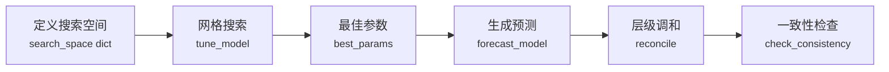
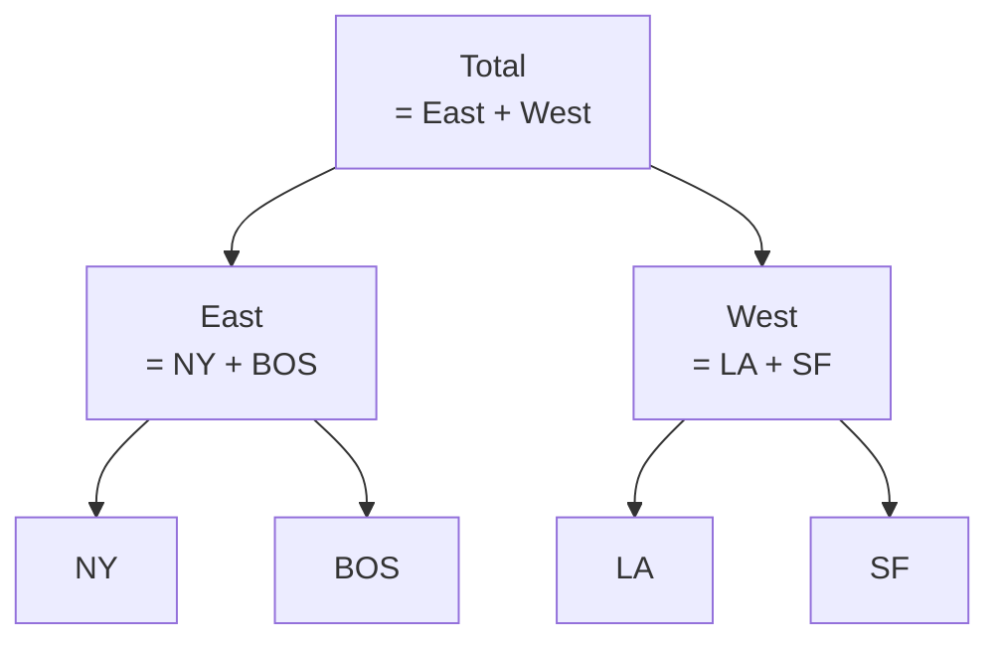

# 调优与层级预测

ForeSight 内置了网格搜索超参数调优和层级时间序列调和功能。调优模块帮助你在给定的搜索空间中找到最佳参数组合，层级预测模块则确保不同层级的预测值在聚合关系上保持一致。

---

## 工作流概览



---

## 网格搜索调优

### 核心概念

网格搜索会遍历 `search_space` 中所有参数组合，对每组参数执行滚动窗口评估，选出最优的参数配置。

!!! info "search_space 格式"

    `search_space` 是一个字典，key 为参数名，value 为候选值列表：

    ```python
    search_space = {
        "alpha": [0.1, 0.3, 0.5, 0.7, 0.9],
        "beta":  [0.01, 0.05, 0.1, 0.2],
    }
    ```

    搜索空间的笛卡尔积即为全部候选组合。上例将产生 5 x 4 = 20 组试验。

### `tune_model`

在内置数据集上执行网格搜索。

```python
from foresight import tune_model

result = tune_model(
    model="holt",
    dataset="catfish",
    horizon=3,
    step=3,
    min_train_size=12,
    search_space={
        "alpha": [0.1, 0.3, 0.5, 0.7],
        "beta":  [0.01, 0.05, 0.1],
    },
    metric="mae",
    mode="min",
    y_col="Total",
)
```

**参数说明：**

| 参数 | 类型 | 必填 | 默认值 | 说明 |
|------|------|:----:|--------|------|
| `model` | `str` | :white_check_mark: | — | 模型名称 |
| `dataset` | `str` | :white_check_mark: | — | 内置数据集名称 |
| `horizon` | `int` | :white_check_mark: | — | 预测步长 |
| `step` | `int` | :white_check_mark: | — | 滚动窗口步长 |
| `min_train_size` | `int` | :white_check_mark: | — | 最小训练集大小 |
| `search_space` | `dict` | :white_check_mark: | — | 参数搜索空间 |
| `metric` | `str` | | `"mae"` | 评估指标（`mae` / `rmse` / `mape` / `smape`） |
| `mode` | `str` | | `"min"` | 优化方向（`min` / `max`） |
| `y_col` | `str` | | `None` | 目标列名 |
| `model_params` | `dict` | | `None` | 固定模型参数（不参与搜索） |
| `max_windows` | `int` | | `None` | 最大评估窗口数 |
| `max_train_size` | `int` | | `None` | 最大训练集大小（rolling window） |

**返回值：**

```python
{
    "best_score": 1.23,         # 最优评估指标值
    "best_params": {"alpha": 0.3, "beta": 0.05},  # 最优参数
    "trials": [                 # 所有试验记录
        {"params": {...}, "score": ...},
        ...
    ],
    "n_trials": 12,             # 总试验次数
}
```

### `tune_model_long_df`

在自定义长格式 DataFrame 上执行网格搜索。

```python
from foresight import tune_model_long_df
import pandas as pd

df = pd.read_csv("my_data.csv", parse_dates=["ds"])

result = tune_model_long_df(
    model="theta",
    long_df=df,
    horizon=6,
    step=3,
    min_train_size=24,
    search_space={"theta": [0.5, 1.0, 1.5, 2.0]},
    metric="rmse",
    mode="min",
)
print(result["best_params"])  # {'theta': 1.0}
```

**参数说明：**

| 参数 | 类型 | 必填 | 默认值 | 说明 |
|------|------|:----:|--------|------|
| `model` | `str` | :white_check_mark: | — | 模型名称 |
| `long_df` | `DataFrame` | :white_check_mark: | — | 长格式数据（含 `unique_id` / `ds` / `y`） |
| `horizon` | `int` | :white_check_mark: | — | 预测步长 |
| `step` | `int` | :white_check_mark: | — | 滚动窗口步长 |
| `min_train_size` | `int` | :white_check_mark: | — | 最小训练集大小 |
| `search_space` | `dict` | :white_check_mark: | — | 参数搜索空间 |
| `metric` | `str` | | `"mae"` | 评估指标 |
| `mode` | `str` | | `"min"` | 优化方向 |
| `model_params` | `dict` | | `None` | 固定模型参数 |
| `max_windows` | `int` | | `None` | 最大评估窗口数 |
| `max_train_size` | `int` | | `None` | 最大训练集大小 |

### CLI 调优

=== "基本用法"

    ```bash
    foresight tuning run \
        --model holt \
        --dataset catfish \
        --y-col Total \
        --horizon 3 --step 3 --min-train-size 12 \
        --grid-param alpha=0.1,0.3,0.5 \
        --grid-param beta=0.01,0.05,0.1 \
        --metric mae \
        --format json
    ```

=== "输出到文件"

    ```bash
    foresight tuning run \
        --model theta \
        --dataset catfish \
        --y-col Total \
        --horizon 6 --step 3 --min-train-size 12 \
        --grid-param theta=0.5,1.0,1.5,2.0 \
        --output results.json --format json
    ```

!!! tip "CLI 中的 `--grid-param`"

    每个 `--grid-param` 对应一个搜索维度，格式为 `key=v1,v2,v3`。可多次使用以定义多维搜索空间。

---

## 层级预测

### 核心概念

层级时间序列（hierarchical time series）中，上层节点的值等于其所有子节点之和。例如：



!!! info "hierarchy 字典格式"

    `hierarchy` 以字典表示父子关系，key 为父节点名称，value 为子节点名称列表：

    ```python
    hierarchy = {
        "Total": ["East", "West"],
        "East":  ["NY", "BOS"],
        "West":  ["LA", "SF"],
    }
    ```

    叶子节点（如 `NY`、`BOS`）不需要出现在 key 中。

### 调和方法

=== "bottom_up"

    **自底向上（Bottom-Up）**：使用叶子节点的预测值，向上逐层聚合。

    - 优点：保留底层细节，不修改叶子节点预测
    - 适用场景：底层数据充足、底层预测质量较高

=== "top_down"

    **自顶向下（Top-Down）**：使用顶层节点的预测值，根据历史占比向下分配。

    - 优点：顶层序列更平滑、易于预测
    - 适用场景：底层数据稀疏、顶层趋势更稳定
    - 需要提供 `history_df` 以计算占比

### `reconcile_hierarchical_forecasts`

对预测结果进行层级调和，使其满足聚合一致性约束。

```python
from foresight import reconcile_hierarchical_forecasts

hierarchy = {
    "Total": ["East", "West"],
    "East":  ["NY", "BOS"],
    "West":  ["LA", "SF"],
}

reconciled_df = reconcile_hierarchical_forecasts(
    forecast_df=forecast_df,
    hierarchy=hierarchy,
    method="bottom_up",
)
```

**参数说明：**

| 参数 | 类型 | 必填 | 默认值 | 说明 |
|------|------|:----:|--------|------|
| `forecast_df` | `DataFrame` | :white_check_mark: | — | 预测结果 DataFrame |
| `hierarchy` | `dict` | :white_check_mark: | — | 层级关系字典 |
| `method` | `str` | :white_check_mark: | — | 调和方法（`bottom_up` / `top_down`） |
| `history_df` | `DataFrame` | | `None` | 历史数据（`top_down` 方法必需） |
| `yhat_col` | `str` | | `"yhat"` | 预测值列名 |
| `exog_agg` | `dict` | | `None` | 外生变量聚合方式 |

**返回值：** 调和后的 `DataFrame`，结构与输入一致。

### `check_hierarchical_consistency`

检查预测结果是否满足层级一致性。

```python
from foresight import check_hierarchical_consistency

result = check_hierarchical_consistency(
    forecast_df=reconciled_df,
    hierarchy=hierarchy,
)
print(result["is_consistent"])  # True
```

**参数说明：**

| 参数 | 类型 | 必填 | 默认值 | 说明 |
|------|------|:----:|--------|------|
| `forecast_df` | `DataFrame` | :white_check_mark: | — | 预测结果 DataFrame |
| `hierarchy` | `dict` | :white_check_mark: | — | 层级关系字典 |
| `yhat_col` | `str` | | `"yhat"` | 预测值列名 |
| `atol` | `float` | | `1e-8` | 绝对容差 |

**返回值：**

```python
{
    "is_consistent": True,         # 是否一致
    "n_inconsistencies": 0,        # 不一致数量
    "inconsistencies": [],         # 不一致详情列表
}
```

### `eval_hierarchical_forecast_df`

对预测结果执行层级调和并评估。

```python
from foresight import eval_hierarchical_forecast_df

metrics = eval_hierarchical_forecast_df(
    forecast_df=forecast_df,
    hierarchy=hierarchy,
    method="bottom_up",
)
```

**参数说明：**

| 参数 | 类型 | 必填 | 默认值 | 说明 |
|------|------|:----:|--------|------|
| `forecast_df` | `DataFrame` | :white_check_mark: | — | 预测结果 DataFrame |
| `hierarchy` | `dict` | :white_check_mark: | — | 层级关系字典 |
| `method` | `str` | :white_check_mark: | — | 调和方法 |
| `history_df` | `DataFrame` | | `None` | 历史数据 |
| `yhat_col` | `str` | | `"yhat"` | 预测值列名 |
| `exog_agg` | `dict` | | `None` | 外生变量聚合方式 |

---

## 完整示例

### 示例 1：调优 Theta 模型

```python
from foresight import tune_model, make_forecaster

# 1. 定义搜索空间
search_space = {
    "theta": [0.5, 1.0, 1.5, 2.0, 2.5, 3.0],
}

# 2. 网格搜索
result = tune_model(
    model="theta",
    dataset="catfish",
    horizon=6,
    step=3,
    min_train_size=24,
    search_space=search_space,
    metric="mae",
    mode="min",
    y_col="Total",
)

print(f"最佳参数: {result['best_params']}")
print(f"最佳 MAE:  {result['best_score']:.4f}")
print(f"试验次数: {result['n_trials']}")

# 3. 使用最佳参数构建 forecaster
f = make_forecaster("theta", **result["best_params"])
```

### 示例 2：层级预测调和

```python
import pandas as pd
from foresight import (
    forecast_model_long_df,
    reconcile_hierarchical_forecasts,
    check_hierarchical_consistency,
)

# 1. 定义层级结构
hierarchy = {
    "Total": ["East", "West"],
    "East":  ["NY", "BOS"],
    "West":  ["LA", "SF"],
}

# 2. 对所有序列生成独立预测
forecast_df = forecast_model_long_df(
    model="theta",
    long_df=historical_df,
    horizon=12,
)

# 3. Bottom-up 调和
reconciled_df = reconcile_hierarchical_forecasts(
    forecast_df=forecast_df,
    hierarchy=hierarchy,
    method="bottom_up",
)

# 4. 验证一致性
check = check_hierarchical_consistency(
    forecast_df=reconciled_df,
    hierarchy=hierarchy,
)
assert check["is_consistent"], f"发现 {check['n_inconsistencies']} 处不一致"

# 5. Top-down 调和（需要历史数据）
reconciled_td = reconcile_hierarchical_forecasts(
    forecast_df=forecast_df,
    hierarchy=hierarchy,
    method="top_down",
    history_df=historical_df,
)
```

!!! warning "top_down 方法需要 history_df"

    使用 `top_down` 方法时必须提供 `history_df`，否则无法计算各子节点的历史占比。

---

## 下一步

- [:octicons-arrow-right-24: 评估与回测](evaluation.md) — 了解滚动窗口评估的详细用法
- [:octicons-arrow-right-24: 概率预测](intervals.md) — 为调优后的模型添加预测区间
- [:octicons-arrow-right-24: CLI 参考](../cli/index.md) — `foresight tuning run` 完整参数
- [:octicons-arrow-right-24: API 参考](../api-reference/index.md) — 所有 API 签名与类型信息
