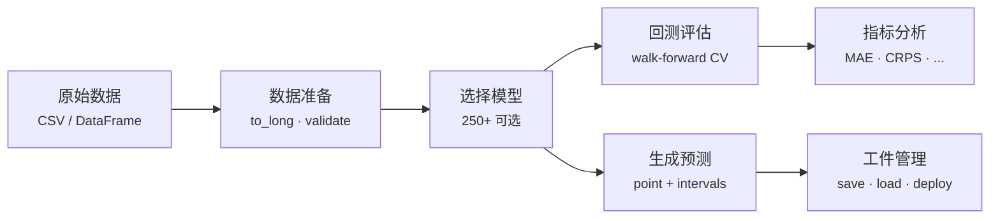

---
hide:
  - navigation
  - toc
---

# ForeSight

<div align="center" markdown>

**轻量级、功能齐全的 Python 时间序列预测工具包**

统一模型注册表 · 滚动窗口回测 · 概率预测 · CLI + Python API

[](https://pypi.org/project/foresight-ts/)
[](https://pypi.org/project/foresight-ts/)
[](https://github.com/skygazer42/ForeSight/blob/main/LICENSE)
[](https://github.com/skygazer42/ForeSight)

</div>

---

## 核心特性

<div class="grid cards" markdown>

-   :material-brain:{ .lg .middle } **250+ 模型，统一接口**

    ---

    统计、机器学习、深度学习模型共享同一个 `forecaster(train, horizon) → ŷ` 契约。从 naive 基线到 Transformer 和 Mamba — 全部统一在一个 API 下。

    [:octicons-arrow-right-24: 模型选择指南](guide/models.md)

-   :material-sync:{ .lg .middle } **回测优先设计**

    ---

    滚动窗口评估（expanding / rolling window）、完整交叉验证预测表、逐步指标、conformal 预测区间 — 全部内置。

    [:octicons-arrow-right-24: 评估与回测](guide/evaluation.md)

-   :material-chart-multiple:{ .lg .middle } **面板 & 全局模型**

    ---

    通过 `unique_id / ds / y` 长格式提供一流的多序列支持。全局模型跨数千个序列训练，支持协变量感知的特征工程。

    [:octicons-arrow-right-24: 全局模型](guide/global-models.md)

-   :material-feather:{ .lg .middle } **默认轻量**

    ---

    核心仅依赖 `numpy` + `pandas`。重量级后端（PyTorch、XGBoost、LightGBM、CatBoost、statsmodels、scikit-learn）全部为可选 extras。

    [:octicons-arrow-right-24: 安装指南](getting-started/installation.md)

-   :material-chart-bell-curve:{ .lg .middle } **概率预测**

    ---

    分位数回归、conformal 区间、bootstrap 区间、CRPS、pinball loss — 面向生产环境的不确定性量化。

    [:octicons-arrow-right-24: 概率预测](guide/intervals.md)

-   :material-factory:{ .lg .middle } **面向生产**

    ---

    `fit` / `predict` 对象 API、模型工件 save/load（含 schema 版本控制）、层级调和、网格搜索调优、完整 CLI。

    [:octicons-arrow-right-24: 模型工件](guide/artifacts.md)

</div>

---

## 快速体验

=== "Python API"

    ```python
    from foresight import eval_model, make_forecaster, make_forecaster_object

    # 1. 滚动窗口评估（内置数据集）
    metrics = eval_model(
        model="theta", dataset="catfish", y_col="Total",
        horizon=3, step=3, min_train_size=12,
    )
    print(metrics)  # {'mae': ..., 'rmse': ..., 'mape': ..., 'smape': ...}

    # 2. 函数式 API — 无状态预测
    f = make_forecaster("holt", alpha=0.3, beta=0.1)
    yhat = f([112, 118, 132, 129, 121, 135, 148, 148], horizon=3)

    # 3. 对象式 API — fit / predict / save / load
    obj = make_forecaster_object("moving-average", window=3)
    obj.fit([1, 2, 3, 4, 5, 6])
    yhat = obj.predict(3)
    ```

=== "CLI"

    ```bash
    # 列出所有模型
    foresight models list

    # 评估模型
    foresight eval run --model theta --dataset catfish --y-col Total \
        --horizon 3 --step 3 --min-train-size 12

    # 从 CSV 预测
    foresight forecast csv --model naive-last --path ./data.csv \
        --time-col ds --y-col y --parse-dates --horizon 7
    ```

[:octicons-arrow-right-24: 5 分钟上手教程](getting-started/quickstart.md){ .md-button .md-button--primary }
[:octicons-arrow-right-24: 安装指南](getting-started/installation.md){ .md-button }

---

## 工作流程



---

## 文档导航

| 章节 | 说明 |
|------|------|
| [快速开始](getting-started/index.md) | 安装、环境验证、5 分钟上手 |
| [使用指南](guide/index.md) | 数据格式、预测、评估、模型选择、概率预测、异常检测等 |
| [CLI 参考](cli/index.md) | 所有 CLI 子命令的完整参数和示例 |
| [API 参考](api-reference/index.md) | Python API 完整签名、参数说明、示例 |
| [进阶主题](advanced/hierarchical.md) | 层级预测、多变量预测、数据工程管道 |
| [模型矩阵](models.md) | 自动生成的模型能力矩阵 |
| [FAQ](faq.md) | 常见问题与解答 |
